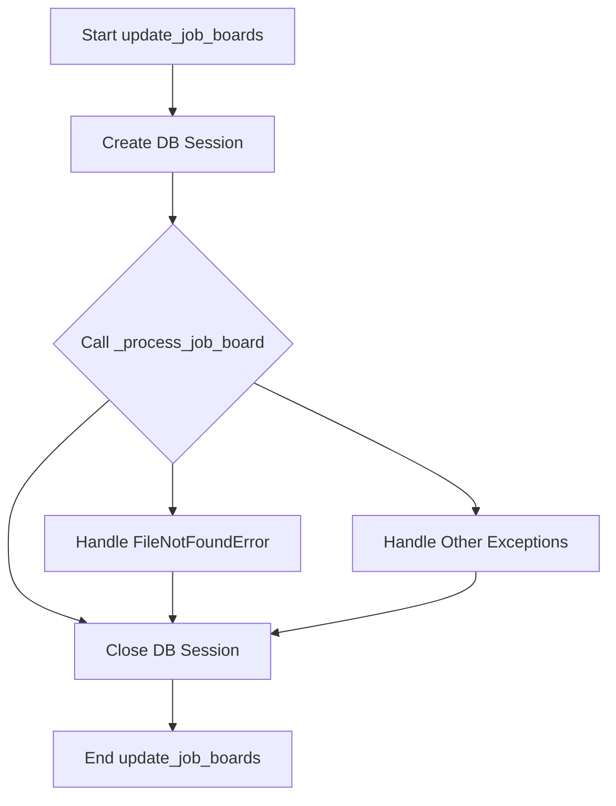
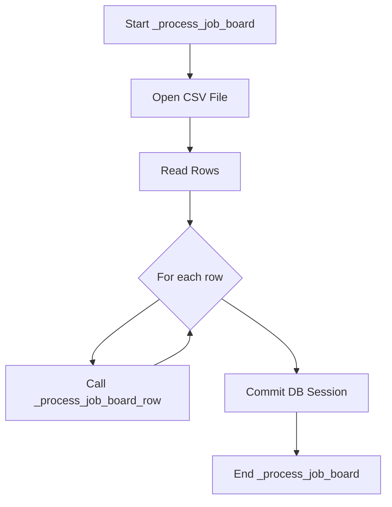
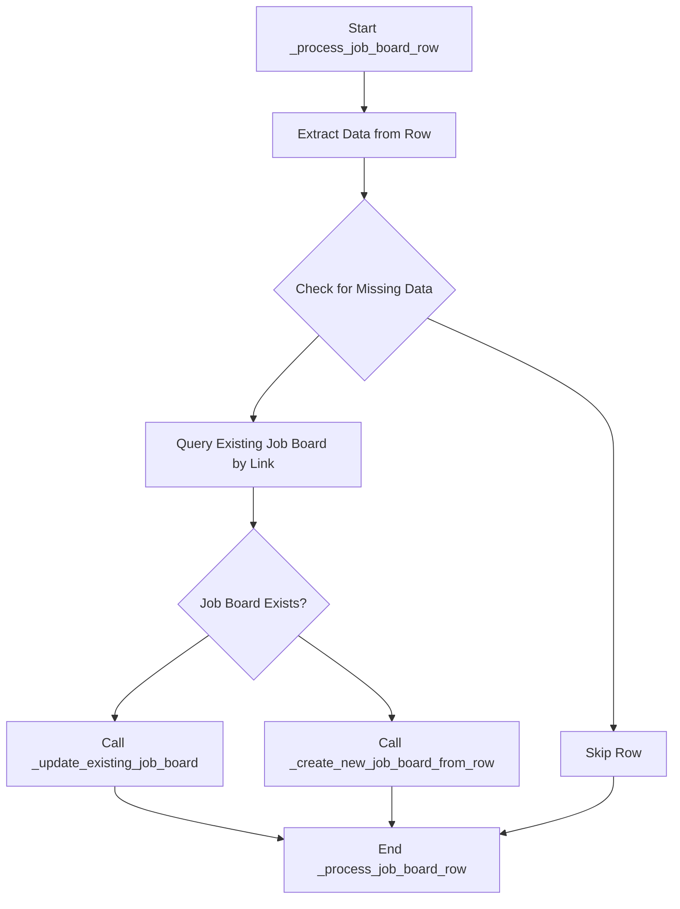
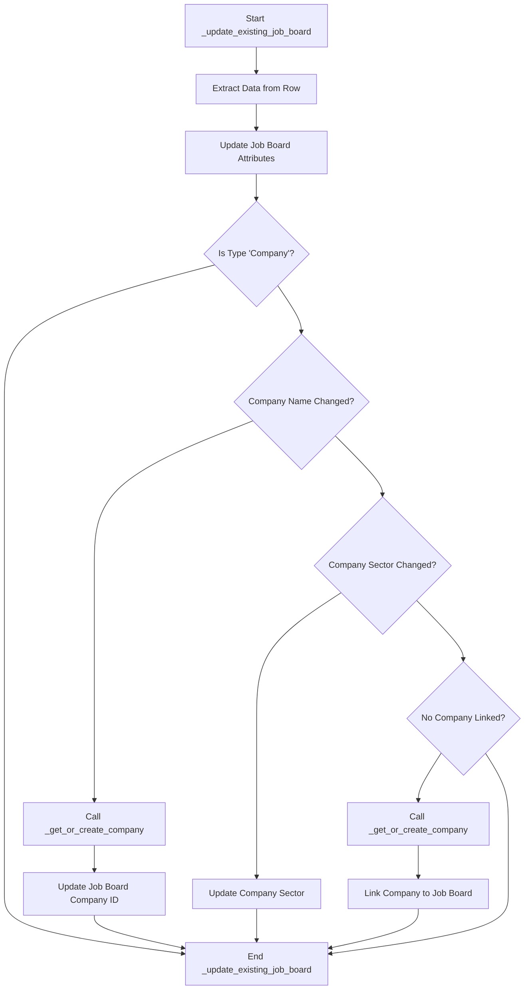
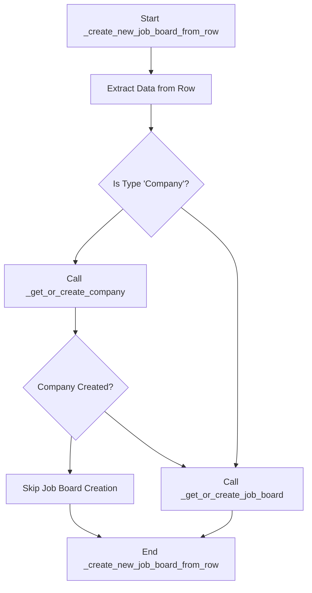

# Database Functions Documentation

This document provides an overview of the main functions and helper functions found in the [`role_aggr/database/functions.py`](role_aggr/database/functions.py) file, detailing their purpose, flow, and interdependencies.

## Main Functions

### [`get_db()`](role_aggr/database/functions.py:11)

**Purpose:** This function serves as a dependency to provide a database session. It is typically used in FastAPI dependency injection to manage database connections.

**Flow:**
1. Creates a new database session using `SessionLocal()`.
2. Yields the database session for use.
3. Ensures the database session is closed in a `finally` block, regardless of whether an error occurred.

### [`init_db()`](role_aggr/database/functions.py:19)

**Purpose:** This function initializes the database by creating all defined tables based on the SQLAlchemy models.

**Flow:**
1. Prints a message indicating the database initialization process.
2. Creates the database directory if it does not already exist using `os.makedirs()`.
3. Creates all tables defined in the `Base.metadata` using `Base.metadata.create_all()`, bound to the database engine.
4. Prints a confirmation message once the tables are created.

### [`update_job_boards(csv_file=CSV_FILE_PATH)`](role_aggr/database/functions.py:45)

**Purpose:** Updates existing job boards or creates new ones based on data from a CSV file.

**Flow:**
1. Prints messages indicating the start of the update process and checks for the existence of the CSV file.
2. Creates a new database session.
3. Calls the helper function [`_process_job_board()`](role_aggr/database/functions.py:144) to handle the row-by-row processing.
4. Includes error handling for `FileNotFoundError` and other exceptions, rolling back the database session in case of an error.
5. Closes the database session in a `finally` block.

**Helper Functions Used:**
- [`_process_job_board()`](role_aggr/database/functions.py:144)

**Function Flow Diagram:**

## Helper Functions

### [`_get_or_create_company(db_session, company_name: str, sector: str)`](role_aggr/database/functions.py:60)

**Purpose:** Retrieves an existing `Company` record from the database based on its name. If no company with the given name exists, it creates a new `Company` record.

### [`_get_or_create_job_board(db_session, name: str, type: str, link: str, platform: str, company_id: int = None)`](role_aggr/database/functions.py:84)

**Purpose:** Retrieves an existing `JobBoard` record from the database based on its link. If no job board with the given link exists, it creates a new `JobBoard` record.

### [`_process_job_board(csv_file, db_session)`](role_aggr/database/functions.py:151)

**Purpose:** Reads a CSV file and processes each row to update existing job boards or create new ones.

**Flow:**
1. Opens the specified CSV file for reading.
2. Creates a `csv.DictReader` to iterate over rows as dictionaries.
3. For each row, calls the helper function [`_process_job_board_row()`](role_aggr/database/functions.py:157), including error handling for individual row processing.
4. Commits the database session after processing all rows.

**Helper Functions Used:**
- [`_process_job_board_row()`](role_aggr/database/functions.py:157)

**Function Flow Diagram:**

### [`_process_job_board_row(db_session, row: dict)`](role_aggr/database/functions.py:157)

**Purpose:** Processes a single row from the CSV file to either update an existing job board or create a new one.

**Flow:**
1. Extracts data (Name, Type, Sector, Link, Platform) from the input row dictionary.
2. Checks if essential data is missing and skips the row if necessary.
3. Queries the database to find an existing job board by its link.
4. If a job board is found, calls [`_update_existing_job_board()`](role_aggr/database/functions.py:176) to update it.
5. If no job board is found, calls [`_create_new_job_board_from_row()`](role_aggr/database/functions.py:210) to create a new one.

**Helper Functions Used:**
- [`_update_existing_job_board()`](role_aggr/database/functions.py:176)
- [`_create_new_job_board_from_row()`](role_aggr/database/functions.py:210)

**Function Flow Diagram:**

### [`_update_existing_job_board(db_session, job_board: JobBoard, row: dict)`](role_aggr/database/functions.py:176)

**Purpose:** Updates an existing `JobBoard` record and its associated `Company` if necessary, based on data from a CSV row.

**Flow:**
1. Extracts data (Name, Type, Sector, Link, Platform) from the input row dictionary.
2. Updates the `name`, `type`, and `platform` attributes of the existing `JobBoard` object.
3. If the job board type is 'Company', it checks for company name or sector changes and updates the associated `Company` record or links to a new/existing one using [`_get_or_create_company()`](role_aggr/database/functions.py:60).

**Helper Functions Used:**
- [`_get_or_create_company()`](role_aggr/database/functions.py:60)

**Function Flow Diagram:**

### [`_create_new_job_board_from_row(db_session, row: dict)`](role_aggr/database/functions.py:210)

**Purpose:** Creates a new `JobBoard` record and its associated `Company` if necessary, based on data from a CSV row.

**Flow:**
1. Extracts data (Name, Type, Sector, Link, Platform) from the input row dictionary.
2. If the job board type is 'Company', it calls [`_get_or_create_company()`](role_aggr/database/functions.py:60) to get or create the company.
3. Calls [`_get_or_create_job_board()`](role_aggr/database/functions.py:84) to create the new job board, linking it to the company if one was created.

**Helper Functions Used:**
- [`_get_or_create_company()`](role_aggr/database/functions.py:60)
- [`_get_or_create_job_board()`](role_aggr/database/functions.py:84)

**Function Flow Diagram:**

