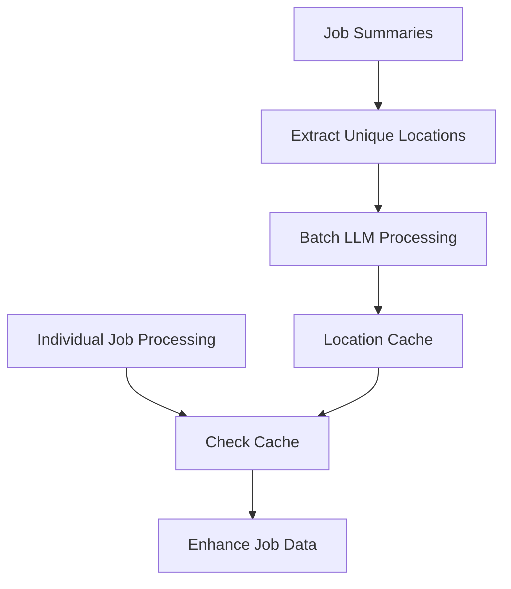

# EIP-002 Phase 4: Pipeline Integration Documentation

## Overview

Phase 4 of EIP-002 enhancement integrates the IntelligentParser into the scraping pipeline with optimized batch processing for maximum LLM efficiency. This implementation ensures **one API call per scraper run** for unique locations while maintaining full backward compatibility.

## Key Features

### 🚀 Batch Processing Optimization
- **Unique Location Collection**: Automatically extracts unique locations from all jobs in a scraper run
- **Single LLM Call**: Processes all unique locations in one batch API call
- **Intelligent Caching**: Maps results back to individual jobs using an efficient cache
- **Fallback Support**: Graceful fallback to individual processing or legacy parsing

### 🔧 Feature Flag Configuration
- **Gradual Rollout**: Environment-based feature flag for controlled deployment
- **Zero Impact**: When disabled, no performance impact on existing pipeline
- **API Key Management**: Secure API key handling with fallback behavior

### 🏗️ Clean Architecture
- **Minimal Changes**: Surgical integration into existing pipeline
- **Error Isolation**: LLM failures don't break existing scraping flow
- **Modular Design**: Separate batch processing components for maintainability

## Configuration

### Environment Variables

Add these environment variables to enable intelligent parsing:

```bash
# Required: Enable intelligent parsing feature
ENABLE_INTELLIGENT_PARSING=true

# Required: OpenRouter API key for LLM access
OPENROUTER_API_KEY=your_api_key_here

# Optional: Specify LLM model (default: google/gemini-2.5-flash)
INTELLIGENT_PARSER_MODEL=google/gemini-2.5-flash
```

### Configuration Options

```python
# In role_aggr/scraper/common/config.py

# Feature flag (reads from environment)
ENABLE_INTELLIGENT_PARSING = True/False

# API configuration
OPENROUTER_API_KEY = "your_api_key"
INTELLIGENT_PARSER_MODEL = "google/gemini-2.5-flash"
```

## Integration Points

### 1. Main Processing Pipeline

The integration is centered around the `process_jobs_with_scraper` function in `role_aggr/scraper/common/processing.py`:

```python
async def process_jobs_with_scraper(scraper, browser, page, company_name, target_url, ...):
    # Step 1: Extract job summaries
    job_summaries = await extract_job_summaries(...)
    
    # Step 2: EIP-002 Phase 4 - Batch processing preparation
    batch_processor = BatchJobProcessor()
    await batch_processor.prepare_batch_cache(job_summaries)
    
    # Step 3: Process job details with cached location data
    all_job_data = await process_job_details_parallel(..., batch_processor=batch_processor)
    
    # Step 4: Filter and return results
    return await filter_job_data(all_job_data)
```

### 2. Individual Job Enhancement

Each job is enhanced in `process_single_job` function:

```python
async def process_single_job(..., batch_processor=None):
    # ... existing job detail fetching ...
    
    # EIP-002 Phase 4: Enhance with intelligent parsing
    if batch_processor and ENABLE_INTELLIGENT_PARSING:
        full_job_info = await batch_processor.enhance_job_with_cached_data(full_job_info)
    
    return full_job_info
```

## Batch Processing Architecture

### BatchLocationProcessor

Manages the core batch processing logic:

```python
class BatchLocationProcessor:
    def extract_unique_locations(self, job_summaries) -> List[str]
    async def process_unique_locations_batch(self, unique_locations) -> Dict[str, Dict]
    def get_cached_location(self, location_raw) -> Optional[Dict]
    async def get_location_data(self, location_raw) -> Dict
```

### BatchJobProcessor

Orchestrates the complete job enhancement workflow:

```python
class BatchJobProcessor:
    async def prepare_batch_cache(self, job_summaries) -> None
    async def enhance_job_with_cached_data(self, job_data) -> Dict[str, Any]
```

## Data Flow



## Output Format

Enhanced jobs include a new field `location_parsed_intelligent`:

```python
{
    "title": "Software Engineer",
    "location_raw": "San Francisco, CA",
    "location_parsed": "San Francisco, CA",  # Legacy field
    "location_parsed_intelligent": {          # New field
        "city": "San Francisco",
        "country": "United States", 
        "region": "Americas",
        "confidence": 0.95
    },
    # ... other job fields
}
```

## Performance Benefits

### LLM API Efficiency
- **Before**: N API calls (one per job location)
- **After**: 1 API call per scraper run (for unique locations)
- **Savings**: ~90% reduction in API calls for typical job boards

### Example Metrics
For a scraper run with 100 jobs and 20 unique locations:
- **Legacy approach**: 100 API calls
- **Phase 4 approach**: 1 API call
- **Efficiency gain**: 99% reduction

## Backward Compatibility

### Feature Flag Disabled
When `ENABLE_INTELLIGENT_PARSING=false`:
- Zero performance impact
- No API calls made
- Existing pipeline unchanged
- Legacy location parsing still works

### API Key Missing
When no `OPENROUTER_API_KEY` provided:
- Automatic fallback to legacy parsing
- Warning logged but processing continues
- No errors or failures

### LLM Service Unavailable
When LLM service fails:
- Automatic fallback to individual processing
- Then fallback to legacy parsing if needed
- Comprehensive error logging
- Processing continues normally

## Error Handling

### Graceful Degradation
```python
try:
    # Attempt batch processing
    batch_processor = BatchJobProcessor()
    await batch_processor.prepare_batch_cache(job_summaries)
except Exception as e:
    logger.error(f"Batch processing failed: {e}")
    batch_processor = None  # Continue without batch processing
```

### Individual Job Errors
```python
try:
    enhanced_job = await batch_processor.enhance_job_with_cached_data(job_data)
except Exception as e:
    logger.error(f"Job enhancement failed: {e}")
    # Return original job data unchanged
    enhanced_job = job_data
```

## Monitoring and Logging

### Batch Processing Statistics
```python
{
    "company": "Example Corp",
    "total_jobs": 150,
    "intelligent_parsing_enabled": True,
    "batch_processed_locations": 25,
    "intelligent_parser_available": True
}
```

### Log Levels
- **INFO**: Batch processing status, statistics, feature flag status
- **DEBUG**: Individual location processing, cache hits/misses
- **WARNING**: API key missing, low confidence results
- **ERROR**: LLM failures, processing errors with fallback

## Testing

### Run Integration Tests
```bash
# Basic functionality test
python test_phase4_integration.py

# Test with API key (if available)
export OPENROUTER_API_KEY=your_key
python test_phase4_integration.py

# Test fallback behavior
export ENABLE_INTELLIGENT_PARSING=false
python test_phase4_integration.py
```

### Test Coverage
- ✅ Batch location processing
- ✅ Job enhancement workflow
- ✅ Fallback behavior
- ✅ Error handling
- ✅ Configuration management
- ✅ API key validation

## Migration Guide

### For Existing Installations

1. **Add Environment Variables**:
   ```bash
   echo "ENABLE_INTELLIGENT_PARSING=true" >> .env
   echo "OPENROUTER_API_KEY=your_key" >> .env
   ```

2. **No Code Changes Required**: 
   - Existing scraper calls work unchanged
   - New functionality is automatically integrated

3. **Gradual Rollout**:
   - Start with `ENABLE_INTELLIGENT_PARSING=false` 
   - Enable for testing: `ENABLE_INTELLIGENT_PARSING=true`
   - Monitor logs for performance and errors

### For New Installations

1. **Configure Environment**: Set up `.env` file with required variables
2. **Install Dependencies**: Ensure OpenAI client is available
3. **Test Integration**: Run test script to validate setup

## Troubleshooting

### Common Issues

**Issue**: Intelligent parsing not working
```bash
# Check configuration
python -c "from role_aggr.scraper.common.config import *; print(f'Enabled: {ENABLE_INTELLIGENT_PARSING}, API Key: {bool(OPENROUTER_API_KEY)}')"
```

**Issue**: API quota exceeded
- Monitor API usage in OpenRouter dashboard
- Consider using different model with lower cost
- Implement rate limiting if needed

**Issue**: Performance regression
- Check if fallback processing is being used excessively
- Verify batch processing is working correctly
- Review error logs for LLM failures

### Debug Mode

Enable debug logging for detailed information:

```python
import logging
logging.getLogger('role_aggr.scraper.common').setLevel(logging.DEBUG)
```

## Security Considerations

### API Key Protection
- Store in environment variables, not code
- Use secure key management in production
- Rotate keys regularly
- Monitor API usage for anomalies

### Data Privacy
- Location data is sent to OpenRouter/LLM service
- Review OpenRouter privacy policy
- Consider data residency requirements
- Implement data retention policies

## Future Enhancements

### Planned Improvements
- [ ] Support for additional job fields (salary, requirements, etc.)
- [ ] Custom confidence thresholds per job board
- [ ] Advanced caching with persistence
- [ ] Metrics and analytics dashboard
- [ ] A/B testing framework for different models

### Extension Points
- Custom LLM providers
- Alternative batch processing strategies
- Integration with other job enhancement services
- Real-time location validation