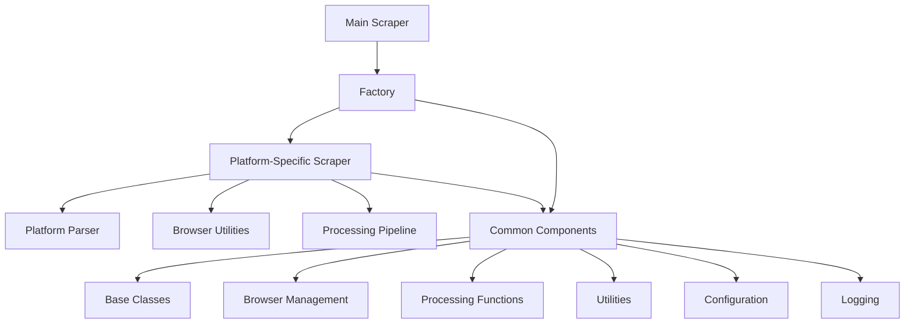
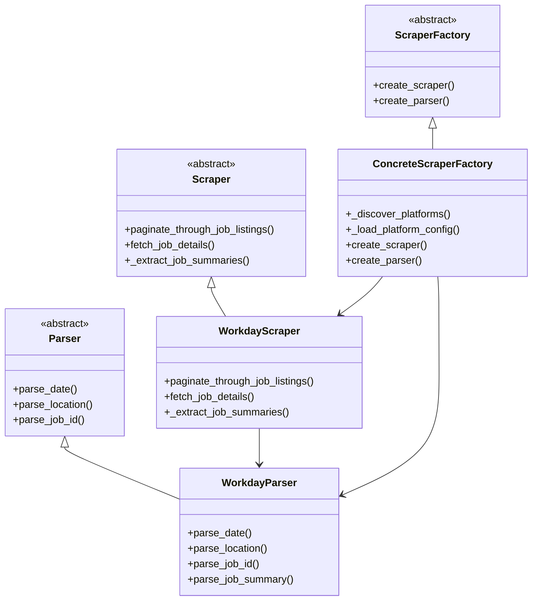
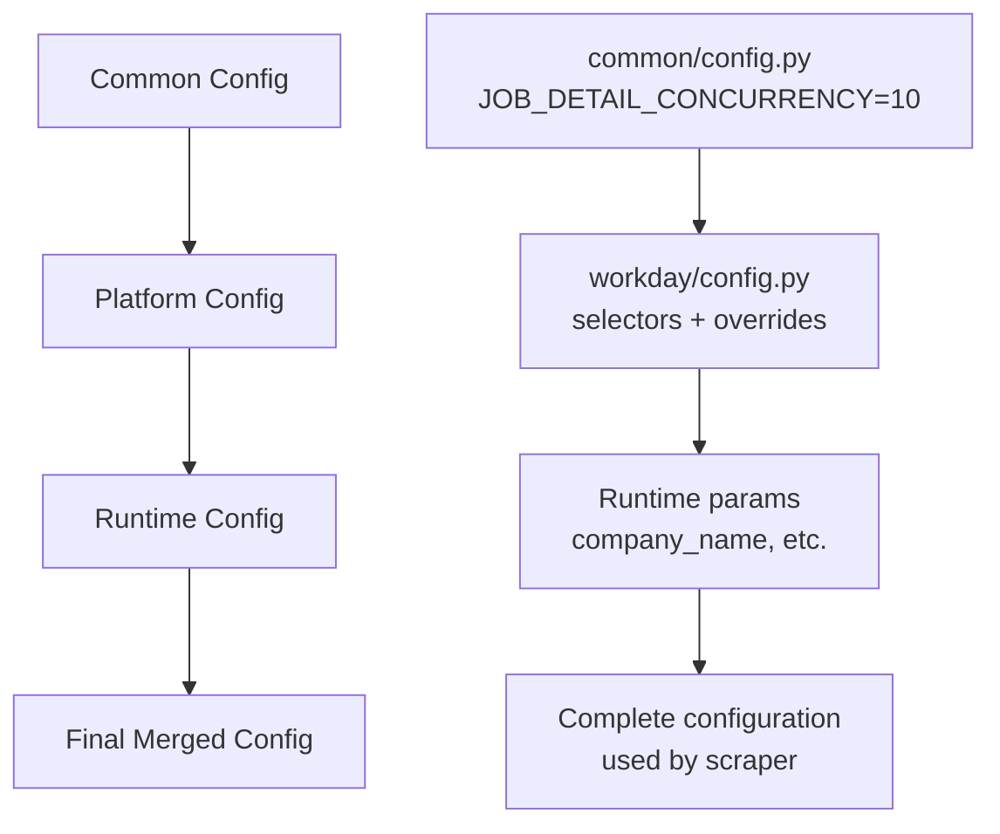

# Scraper Module Documentation

This document provides a comprehensive overview of the role_aggr scraper system, its architecture, components, and usage patterns.

## Table of Contents

- [Overview](#overview)
- [Architecture](#architecture)
- [Quick Start](#quick-start)
- [Module Structure](#module-structure)
- [Core Components](#core-components)
- [Platform Support](#platform-support)
- [Configuration](#configuration)
- [Usage Examples](#usage-examples)
- [Development Guide](#development-guide)
- [Migration Guide](#migration-guide)

## Overview

The role_aggr scraper is a modular, extensible system for scraping job listings from various job board platforms. It implements a factory pattern with abstract base classes to provide a unified interface across different job board platforms while allowing platform-specific customizations.

### Key Features

- **Platform Agnostic:** Unified interface for different job board platforms
- **Factory Pattern:** Dynamic platform discovery and instantiation
- **Parallel Processing:** Concurrent job detail fetching with configurable limits
- **Robust Error Handling:** Comprehensive error recovery and graceful degradation
- **Modular Design:** Clear separation of concerns with testable components
- **Configuration Management:** Hierarchical configuration with platform-specific overrides

### Supported Platforms

- **Workday:** Full implementation with pagination, infinite scroll, and detail extraction
- **Extensible:** Framework ready for additional platforms (Greenhouse, Lever, etc.)

## Architecture

### High-Level Architecture



### Component Relationships



## Quick Start

### Basic Usage

```python
import asyncio
from role_aggr.scraper import scraper

async def main():
    # Simple scraping example
    job_data = await scraper(
        company_name="Deutsche Bank",
        target_url="https://db.wd3.myworkdayjobs.com/en-US/DBWebsite",
        platform="workday",
        max_pages=5,
        to_csv=True,
        output_filename="jobs.csv",
        show_loading_bar=True
    )
    print(f"Scraped {len(job_data)} jobs")

asyncio.run(main())
```

### Factory Pattern Usage

```python
from role_aggr.scraper.factory import ConcreteScraperFactory
from playwright.async_api import async_playwright

async def advanced_usage():
    # Create factory and scraper
    factory = ConcreteScraperFactory()
    scraper = factory.create_scraper('workday', {
        'company_name': 'Deutsche Bank'
    })
    
    # Use with Playwright
    async with async_playwright() as p:
        browser = await p.chromium.launch()
        page = await browser.new_page()
        await page.goto('https://db.wd3.myworkdayjobs.com/en-US/DBWebsite')
        
        # Extract job summaries
        job_summaries = await scraper.paginate_through_job_listings(
            page=page,
            company_name='Deutsche Bank',
            target_url='https://db.wd3.myworkdayjobs.com/en-US/DBWebsite',
            max_pages=3
        )
        
        await browser.close()
        return job_summaries
```

## Module Structure

```
docs/scraper/
├── README.md                           # This overview document
├── main.md                            # Main scraper function
├── factory.md                         # Factory implementation
├── browser.md                         # Legacy browser module (deprecated)
├── config.md                          # Legacy config module (deprecated)
├── common/
│   ├── base.md                        # Abstract base classes
│   ├── browser.md                     # Browser utilities
│   ├── config.md                      # Common configuration
│   ├── logging.md                     # Logging setup
│   ├── processing.md                  # Job processing pipeline
│   └── utils.md                       # Utility functions
└── platforms/
    └── workday/
        ├── config.md                  # Workday-specific configuration
        ├── crawler.md                 # Workday scraper implementation
        ├── details.md                 # Job detail extraction
        └── parser.md                  # Workday data parser
```

## Core Components

### [Main Scraper](main.md)
The primary entry point that orchestrates the complete scraping process using platform-specific components.

### [Factory System](factory.md)
Implements the Factory pattern for dynamic platform discovery and scraper instantiation.

### [Abstract Base Classes](common/base.md)
Defines the core interfaces that all platform implementations must follow.

### [Processing Pipeline](common/processing.md)
Handles job summary extraction, parallel detail fetching, and data filtering.

### [Browser Management](common/browser.md)
Provides browser automation utilities for page navigation and content extraction.

## Platform Support

### Workday Platform

**Components:**
- [**Crawler**](platforms/workday/crawler.md): Main scraper implementation
- [**Parser**](platforms/workday/parser.md): Data parsing and cleaning
- [**Details**](platforms/workday/details.md): Job detail extraction
- [**Config**](platforms/workday/config.md): Platform-specific selectors

**Features:**
- Automatic pagination vs infinite scroll detection
- Robust date parsing (relative and absolute formats)
- Location string cleaning and normalization
- Job ID extraction with fallback strategies
- Comprehensive error handling and recovery

### Adding New Platforms

To add support for a new platform (e.g., Greenhouse):

1. **Create Platform Directory:**
   ```
   role_aggr/scraper/platforms/greenhouse/
   ├── __init__.py
   ├── config.py      # Platform-specific selectors
   ├── crawler.py     # Scraper implementation
   ├── parser.py      # Data parser
   └── details.py     # Job detail extraction
   ```

2. **Implement Required Interfaces:**
   ```python
   # crawler.py
   class GreenhouseScraper(Scraper):
       async def paginate_through_job_listings(self, ...):
           # Implementation
       
       async def fetch_job_details(self, ...):
           # Implementation
   
   # parser.py
   class GreenhouseParser(Parser):
       def parse_date(self, date_str_raw):
           # Implementation
   ```

3. **Factory Auto-Discovery:**
   The factory automatically discovers new platforms when they follow the required structure.

## Configuration

### Configuration Hierarchy



### Configuration Files

- **[Common Config](common/config.md):** Shared settings across all platforms
- **[Platform Config](platforms/workday/config.md):** Platform-specific selectors and settings
- **Runtime Config:** Parameters passed during scraper creation

### Performance Settings

```python
# Common configuration
JOB_DETAIL_CONCURRENCY = 10  # Max concurrent detail fetching

# Platform-specific overrides
WORKDAY_CONCURRENCY = 8      # Conservative for Workday
GREENHOUSE_CONCURRENCY = 15  # More aggressive for Greenhouse
```

## Usage Examples

### Basic Job Scraping

```python
from role_aggr.scraper import scraper

# Scrape to database (default)
job_data = await scraper(
    company_name="Example Corp",
    target_url="https://example.wd1.myworkdayjobs.com/careers",
    platform="workday",
    max_pages=10
)

# Scrape to CSV
await scraper(
    company_name="Example Corp",
    target_url="https://example.wd1.myworkdayjobs.com/careers",
    platform="workday",
    to_csv=True,
    output_filename="example_jobs.csv"
)
```

### Advanced Processing

```python
from role_aggr.scraper.common.processing import process_jobs_with_scraper
from role_aggr.scraper.factory import ConcreteScraperFactory

async def custom_processing():
    factory = ConcreteScraperFactory()
    scraper = factory.create_scraper('workday', {
        'company_name': 'Example Corp',
        'job_detail_concurrency': 15  # Custom concurrency
    })
    
    async with async_playwright() as p:
        browser = await p.chromium.launch()
        page = await browser.new_page()
        
        # Complete pipeline with custom settings
        job_data = await process_jobs_with_scraper(
            scraper=scraper,
            browser=browser,
            page=page,
            company_name='Example Corp',
            target_url='https://example.wd1.myworkdayjobs.com/careers',
            use_parallel_processing=True,
            show_loading_bar=True
        )
        
        await browser.close()
        return job_data
```

### Custom Data Processing

```python
async def custom_data_extraction():
    # Use parser independently
    from role_aggr.scraper.platforms.workday.parser import WorkdayParser
    
    parser = WorkdayParser()
    
    # Parse individual data elements
    clean_date = parser.parse_date("Posted 3 days ago")
    clean_location = parser.parse_location("Locations: New York, NY")
    clean_job_id = parser.parse_job_id("Job ID: 12345")
    
    return {
        'date': clean_date,
        'location': clean_location,
        'job_id': clean_job_id
    }
```

## Development Guide

### Setting Up Development Environment

```bash
# Install dependencies
pip install playwright beautifulsoup4 tqdm dateutil

# Install Playwright browsers
playwright install chromium
```

### Running Tests

```python
# Unit testing example
import pytest
from role_aggr.scraper.platforms.workday.parser import WorkdayParser

def test_date_parsing():
    parser = WorkdayParser()
    assert parser.parse_date("Posted today") == datetime.now().date().isoformat()
    assert parser.parse_date("Posted 3 days ago") is not None
```

### Debugging

```python
# Enable debug logging
from role_aggr.scraper.common.logging import setup_scraper_logger
import logging

logger = setup_scraper_logger()
logger.setLevel(logging.DEBUG)

# Use show_loading_bar for real-time feedback
await scraper(
    company_name="Debug Corp",
    target_url="https://example.com/jobs",
    platform="workday",
    show_loading_bar=True  # Shows progress in console
)
```

### Code Style and Best Practices

1. **Follow ABC Interfaces:** All platform implementations must inherit from base classes
2. **Error Handling:** Use comprehensive try-catch blocks with meaningful logging
3. **Configuration:** Use hierarchical configuration system
4. **Testing:** Write unit tests for parsing functions and integration tests for scrapers
5. **Documentation:** Follow the established documentation patterns

## Migration Guide

### From Legacy to Modern Architecture

#### Legacy Code (Pre-Factory)

```python
# Old approach - direct imports and manual configuration
from role_aggr.scraper.config import JOB_TITLE_SELECTOR
from role_aggr.scraper.browser import fetch_job_details

# Manual scraping logic
job_elements = await page.query_selector_all(JOB_TITLE_SELECTOR)
# ... manual processing
```

#### Modern Code (Post-Factory)

```python
# New approach - factory pattern with automatic configuration
from role_aggr.scraper.factory import ConcreteScraperFactory

factory = ConcreteScraperFactory()
scraper = factory.create_scraper('workday', {'company_name': 'Example'})

# Automated scraping with built-in processing
job_summaries = await scraper.paginate_through_job_listings(page, ...)
```

### Migration Steps

1. **Identify Legacy Usage:** Find direct imports from deprecated modules
2. **Update Imports:** Switch to factory pattern and modern interfaces
3. **Update Configuration:** Move to hierarchical configuration system
4. **Test Functionality:** Ensure equivalent behavior with new implementation
5. **Remove Legacy Dependencies:** Clean up old imports and unused code

### Deprecated Modules

- [`browser.py`](browser.md) → Use [`platforms/workday/details.py`](platforms/workday/details.md)
- [`config.py`](config.md) → Use [`platforms/workday/config.py`](platforms/workday/config.md)

## Logging and Monitoring

### Log Configuration

```python
from role_aggr.scraper.common.logging import setup_scraper_logger

logger = setup_scraper_logger()

# Logs are written to: role_aggr/logs/scraper/scraper.log
# With automatic rotation (5MB files, 5 backups)
```

### Performance Monitoring

```python
# Monitor scraping performance
logger.info(f"Starting scraper for {company_name}")
start_time = time.time()

job_data = await scraper(...)

duration = time.time() - start_time
logger.info(f"Scraping completed in {duration:.2f} seconds")
logger.info(f"Total jobs scraped: {len(job_data)}")
```

### Error Tracking

```python
try:
    job_data = await scraper(...)
except Exception as e:
    logger.error(f"Scraping failed: {e}", exc_info=True)
    # exc_info=True includes full stack trace
```

## Troubleshooting

### Common Issues

1. **Timeout Errors:** Increase timeout values in platform config
2. **Selector Failures:** Check if job board HTML structure changed
3. **Rate Limiting:** Reduce concurrency settings
4. **Memory Issues:** Lower `JOB_DETAIL_CONCURRENCY` value

### Performance Optimization

1. **Concurrency Tuning:** Adjust `JOB_DETAIL_CONCURRENCY` based on target server capabilities
2. **Resource Blocking:** Images and CSS are automatically blocked for faster loading
3. **Parallel Processing:** Use parallel detail fetching for better throughput
4. **Error Recovery:** Implement retry logic with exponential backoff

### Getting Help

- **Documentation:** Check module-specific documentation for detailed information
- **Logging:** Enable debug logging for detailed operation traces
- **Testing:** Use `show_loading_bar=True` for real-time progress feedback
- **Code Examples:** Refer to usage examples in this document and module docs

## Contributing

When contributing to the scraper system:

1. **Follow Architecture:** Use factory pattern and ABC interfaces
2. **Add Tests:** Include unit tests for new functionality
3. **Update Documentation:** Add documentation following established patterns
4. **Platform Support:** Consider cross-platform compatibility
5. **Performance:** Consider memory usage and processing efficiency

## License and Support

This scraper system is part of the role_aggr project. For support, issues, and contributions, refer to the main project repository and documentation.