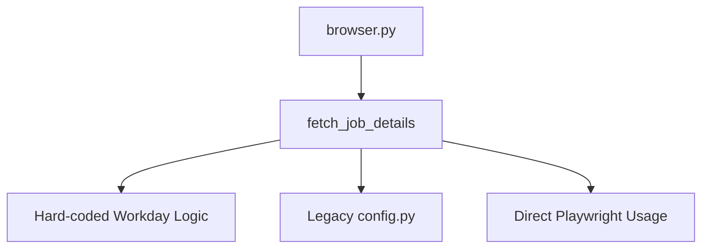
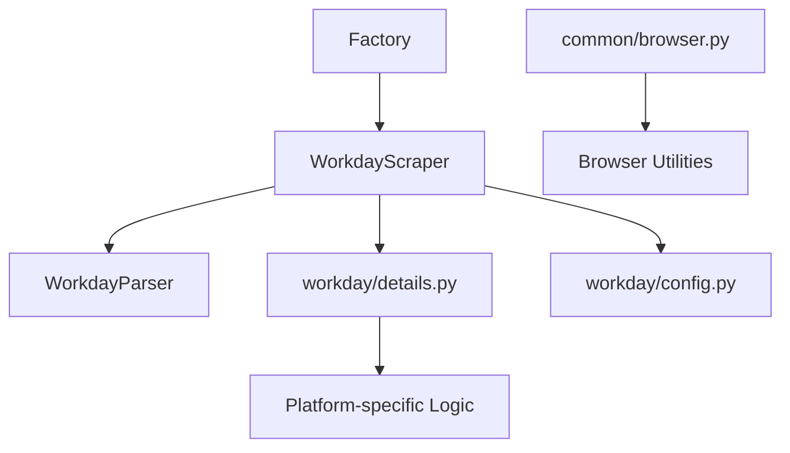

# Legacy Browser Module Documentation

This document provides an overview of the legacy browser functionality found in the [`role_aggr/scraper/browser.py`](../role_aggr/scraper/browser.py) file, detailing its purpose and relationship to the new modular browser system.

## Overview

The legacy browser module contains job detail fetching functionality that was used before the implementation of the modular platform system. This file is maintained for backward compatibility but has been largely superseded by the platform-specific implementations and common browser utilities.

## Main Function

### [`fetch_job_details()`](../role_aggr/scraper/browser.py:10)

**Purpose:** Legacy function for fetching job details from Workday job posting pages.

**Parameters:**
- `page` (Page): Playwright page object
- `job_url` (str): URL of the job detail page
- `show_loading_bar` (bool): Whether to show loading progress

**Returns:** Dictionary containing job details

**Status:** **DEPRECATED** - Use platform-specific implementations instead

## Function Implementation

### Job Detail Extraction

**Extracted Fields:**
- `url`: The job detail page URL
- `description`: Job description using [`JOB_DESCRIPTION_SELECTOR`](../role_aggr/scraper/config.py:16)
- `job_id`: Job ID using [`JOB_ID_DETAIL_SELECTOR`](../role_aggr/scraper/config.py:17)
- `detail_page_title`: Page title using hard-coded selector

**Selectors Used:**
```python
# From legacy config.py
JOB_DESCRIPTION_SELECTOR = "div[data-automation-id='jobPostingDescription']"
JOB_ID_DETAIL_SELECTOR = "span[data-automation-id='jobPostingJobId']"

# Hard-coded in function
title_selector = "h1[data-automation-id='jobPostingHeader']"
fallback_job_id_selector = "span:has-text('Job Id:') + span"
```

## Migration Path

### From Legacy to Platform-Specific

**Old Usage:**
```python
from role_aggr.scraper.browser import fetch_job_details

job_details = await fetch_job_details(page, job_url, show_loading_bar)
```

**New Usage:**
```python
from role_aggr.scraper.platforms.workday.details import fetch_job_details

job_details = await fetch_job_details(page, job_url, show_loading_bar)
```

### Factory Pattern Integration

**Modern Approach:**
```python
from role_aggr.scraper.factory import ConcreteScraperFactory

factory = ConcreteScraperFactory()
scraper = factory.create_scraper('workday', {'company_name': 'Example'})

# Job detail fetching handled by scraper
job_details = await scraper.fetch_job_details(page, job_url, show_loading_bar)
```

## Differences from Modern Implementation

### Code Organization

**Legacy (Single File):**
- Job detail fetching mixed with browser utilities
- Hard-coded Workday-specific logic
- No platform abstraction

**Modern (Modular):**
- [`common/browser.py`](common/browser.md): Browser management utilities
- [`platforms/workday/details.py`](platforms/workday/details.md): Platform-specific detail extraction
- [`platforms/workday/crawler.py`](platforms/workday/crawler.md): Integrated scraper implementation

### Configuration Management

**Legacy:**
```python
from .config import JOB_DESCRIPTION_SELECTOR, JOB_ID_DETAIL_SELECTOR
```

**Modern:**
```python
from .config import (
    JOB_DESCRIPTION_SELECTOR,
    JOB_ID_DETAIL_SELECTOR
)
# Configuration loaded automatically by factory
```

### Error Handling

**Legacy:** Basic error handling with minimal logging

**Modern:** Comprehensive error handling with:
- Detailed logging with context
- Graceful degradation strategies
- Platform-specific error recovery

## Deprecation Notice

**Status:** This module is **DEPRECATED** and maintained only for backward compatibility.

**Issues with Legacy Implementation:**
1. **Tight Coupling:** Mixed browser utilities with job detail extraction
2. **Platform Specific:** Hard-coded for Workday without abstraction
3. **Limited Error Handling:** Basic error recovery
4. **No Testing:** Difficult to unit test due to tight coupling

**Recommended Action:**
- New implementations should use platform-specific detail extraction
- Existing code should migrate to use factory pattern and scraper abstractions
- Direct imports from this module should be avoided

## Architecture Comparison

### Legacy Architecture



### Modern Architecture



## Dependencies

**External Libraries:**
- `playwright.async_api`: For browser automation

**Internal Dependencies:**
- [`role_aggr.scraper.config`](config.md): Legacy configuration (also deprecated)
- [`role_aggr.scraper.common.logging`](common/logging.md): Logging setup

**Used By:**
- Legacy code that hasn't been migrated
- Backward compatibility layer

## Migration Examples

### Before (Legacy)

```python
from role_aggr.scraper.browser import fetch_job_details

async def process_job_details(page, job_urls):
    details = []
    for url in job_urls:
        detail = await fetch_job_details(page, url, show_loading_bar=True)
        details.append(detail)
    return details
```

### After (Modern)

```python
from role_aggr.scraper.factory import ConcreteScraperFactory

async def process_job_details(browser, job_summaries):
    factory = ConcreteScraperFactory()
    scraper = factory.create_scraper('workday', {'company_name': 'Example'})
    
    # Use modern parallel processing
    from role_aggr.scraper.common.processing import process_job_details_parallel
    
    details = await process_job_details_parallel(
        scraper=scraper,
        browser=browser,
        company_name='Example',
        job_summaries=job_summaries,
        show_loading_bar=True
    )
    return details
```

## Functional Equivalent

The functionality in this legacy module has been replaced by:

1. **Platform-specific detail extraction:** [`platforms/workday/details.py`](platforms/workday/details.md)
2. **Browser management utilities:** [`common/browser.py`](common/browser.md)
3. **Integrated scraper interface:** [`platforms/workday/crawler.py`](platforms/workday/crawler.md)
4. **Parallel processing capabilities:** [`common/processing.py`](common/processing.md)

## Removal Timeline

**Current Status:** Deprecated but functional

**Migration Period:** Existing code should migrate to modern implementations

**Future Removal:** This module will be removed once all dependent code has been migrated to the new architecture

## Testing Considerations

**Legacy Testing Challenges:**
- Tight coupling makes unit testing difficult
- No clear separation of concerns
- Hard to mock dependencies

**Modern Testing Benefits:**
- Clear interfaces enable better unit testing
- Dependency injection supports mocking
- Separation of concerns allows focused testing

**Migration Testing Strategy:**
1. Test legacy functionality to establish baseline
2. Implement equivalent modern functionality
3. Compare outputs to ensure consistency
4. Gradually migrate dependent code
5. Remove legacy code once migration complete