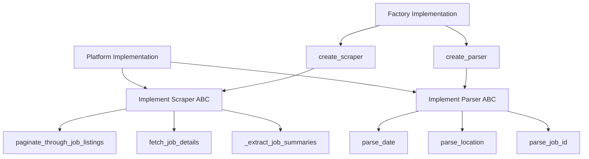
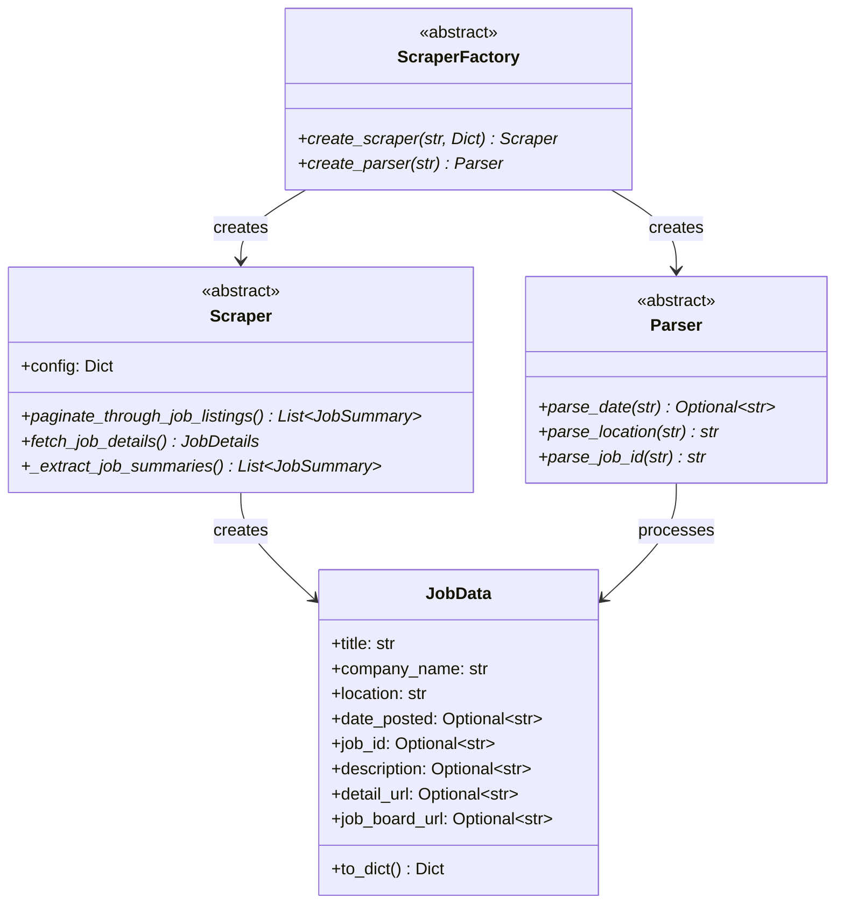

# Common Base Classes Documentation

This document provides an overview of the abstract base classes found in the [`role_aggr/scraper/common/base.py`](../../role_aggr/scraper/common/base.py) file, detailing the core interfaces that all platform-specific scrapers and parsers must implement.

## Overview

The base module defines the core interfaces for the scraper system using abstract base classes (ABC). These interfaces ensure consistency and maintainability across different job board platforms by providing a contract that all implementations must follow.

## Abstract Base Classes

### [`Scraper`](../../role_aggr/scraper/common/base.py:17)

**Purpose:** Abstract base class that defines the interface for platform-specific scrapers. All platform scrapers must implement this interface to handle job listing pagination, data extraction, and detail fetching.

**Key Responsibilities:**
- Job listing pagination and navigation
- Job summary extraction from listing pages
- Job detail fetching from individual job pages
- Platform-specific configuration management

#### Abstract Methods

##### [`paginate_through_job_listings()`](../../role_aggr/scraper/common/base.py:34)

**Purpose:** Navigate through job listing pages and extract job summaries using platform-specific pagination logic.

**Parameters:**
- `page` (Page): Playwright page object for browser interaction
- `company_name` (str): Name of the company/job board being scraped
- `target_url` (str): Base URL of the job board
- `max_pages` (Optional[int]): Maximum number of pages to scrape
- `show_loading_bar` (bool): Whether to display progress indicators

**Returns:** List of job summary dictionaries containing basic job information

**Implementation Requirements:**
- Handle both infinite scroll and traditional pagination
- Extract job summaries from each page
- Respect max_pages limit when specified
- Provide progress feedback when requested

##### [`fetch_job_details()`](../../role_aggr/scraper/common/base.py:66)

**Purpose:** Fetch detailed information from a specific job posting page.

**Parameters:**
- `page` (Page): Playwright page object for browser interaction
- `job_url` (str): URL of the specific job detail page
- `show_loading_bar` (bool): Whether to display progress indicators

**Returns:** Dictionary containing detailed job information including:
- `url`: The job detail page URL
- `description`: Full job description text
- `job_id`: Platform-specific job identifier
- `detail_page_title`: Job title from the detail page
- Additional platform-specific fields

##### [`_extract_job_summaries()`](../../role_aggr/scraper/common/base.py:99)

**Purpose:** Extract job summary information from the current page (helper method).

**Parameters:**
- `page` (Page): Playwright page object for browser interaction
- `target_url` (str): Base URL for constructing absolute URLs
- `show_loading_bar` (bool): Whether to display progress indicators

**Returns:** List of job summary dictionaries containing:
- `title`: Job title
- `detail_url`: URL to the job detail page
- `location_raw`: Raw location text from the listing
- `location_parsed`: Cleaned/parsed location
- `date_posted_raw`: Raw date text from the listing
- `date_posted_parsed`: Parsed date in ISO format

### [`Parser`](../../role_aggr/scraper/common/base.py:132)

**Purpose:** Abstract base class for platform-specific data parsers. Defines the interface for parsing and cleaning data extracted from job listings to ensure consistent data formats across platforms.

#### Abstract Methods

##### [`parse_date()`](../../role_aggr/scraper/common/base.py:140)

**Purpose:** Parse platform-specific date strings into standardized ISO format.

**Parameters:**
- `date_str_raw` (str): Raw date string from the job listing

**Returns:** ISO format date string (YYYY-MM-DD) or None if parsing fails

**Expected Formats:**
- Relative dates: "Posted today", "2 days ago"
- Absolute dates: "Posted Jan 10, 2024", "01/10/2024"
- Invalid dates should return None

##### [`parse_location()`](../../role_aggr/scraper/common/base.py:163)

**Purpose:** Parse and clean location strings from job listings.

**Parameters:**
- `location_str_raw` (str): Raw location string from the job listing

**Returns:** Cleaned location string

**Expected Cleaning:**
- Remove prefixes like "Locations:"
- Trim whitespace
- Standardize format

##### [`parse_job_id()`](../../role_aggr/scraper/common/base.py:185)

**Purpose:** Parse and extract job ID from platform-specific formats.

**Parameters:**
- `job_id_raw` (str): Raw job ID string from the job detail page

**Returns:** Cleaned job ID string

**Expected Cleaning:**
- Remove prefixes like "Job ID:"
- Extract core identifier
- Handle platform-specific formats

### [`ScraperFactory`](../../role_aggr/scraper/common/base.py:207)

**Purpose:** Abstract factory for creating platform-specific scrapers and parsers using the Factory design pattern.

#### Abstract Methods

##### [`create_scraper()`](../../role_aggr/scraper/common/base.py:215)

**Purpose:** Create a platform-specific scraper instance.

**Parameters:**
- `platform` (str): Platform identifier (e.g., "workday", "greenhouse")
- `config` (Dict[str, Any]): Platform-specific configuration dictionary

**Returns:** Configured scraper instance for the specified platform

##### [`create_parser()`](../../role_aggr/scraper/common/base.py:233)

**Purpose:** Create a platform-specific parser instance.

**Parameters:**
- `platform` (str): Platform identifier

**Returns:** Parser instance for the specified platform

## Data Classes

### [`JobData`](../../role_aggr/scraper/common/base.py:251)

**Purpose:** Data class representing standardized job information across all platforms.

**Key Fields:**
- `title` (str): Job title
- `company_name` (str): Name of the hiring company
- `location` (str): Job location (parsed/cleaned)
- `date_posted` (Optional[str]): Date posted in ISO format
- `job_id` (Optional[str]): Platform-specific job identifier
- `description` (Optional[str]): Full job description
- `detail_url` (Optional[str]): URL to the job detail page
- `job_board_url` (Optional[str]): URL of the job board/listing page

#### Methods

##### [`to_dict()`](../../role_aggr/scraper/common/base.py:299)

**Purpose:** Convert job data to dictionary format for serialization.

**Returns:** Dictionary representation of the job data

## Type Aliases

The module provides type aliases for better code documentation:

- `JobSummary`: Dict[str, Any] - Basic job information from listing pages
- `JobDetails`: Dict[str, Any] - Detailed job information from detail pages  
- `PlatformConfig`: Dict[str, Any] - Platform-specific configuration

## Implementation Flow Diagram



## Interface Contract



## Usage Example

```python
from abc import ABC, abstractmethod
from role_aggr.scraper.common.base import Scraper, Parser

class MyPlatformScraper(Scraper):
    async def paginate_through_job_listings(self, page, company_name, target_url, max_pages=None, show_loading_bar=False):
        # Implementation for platform-specific pagination
        pass
    
    async def fetch_job_details(self, page, job_url, show_loading_bar=False):
        # Implementation for platform-specific detail fetching
        pass
    
    async def _extract_job_summaries(self, page, target_url, show_loading_bar=False):
        # Implementation for platform-specific summary extraction
        pass

class MyPlatformParser(Parser):
    def parse_date(self, date_str_raw):
        # Implementation for platform-specific date parsing
        pass
    
    def parse_location(self, location_str_raw):
        # Implementation for platform-specific location parsing
        pass
    
    def parse_job_id(self, job_id_raw):
        # Implementation for platform-specific job ID parsing
        pass
```

## Dependencies

**External Libraries:**
- `abc`: For abstract base class definitions
- `typing`: For type hints and annotations
- `playwright.async_api`: For Playwright types (Page, Browser)

**Design Patterns:**
- **Abstract Factory Pattern**: For creating platform-specific implementations
- **Template Method Pattern**: For defining common workflow with customizable steps
- **Strategy Pattern**: For platform-specific parsing and extraction strategies