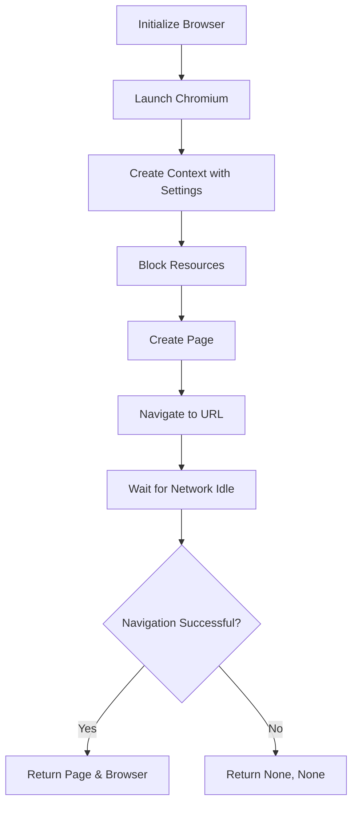
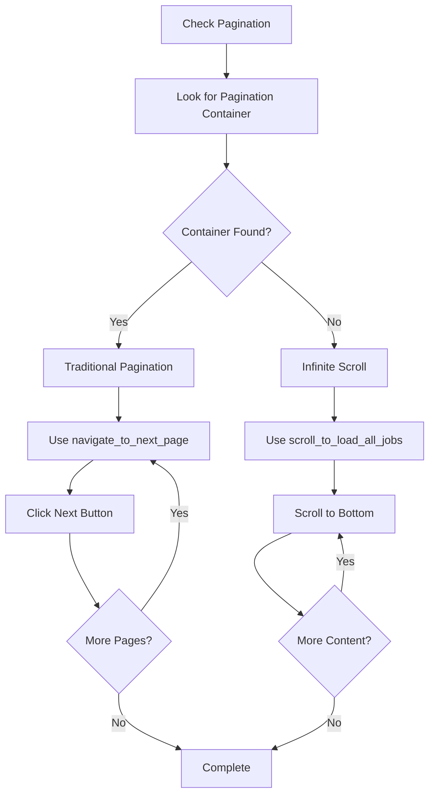
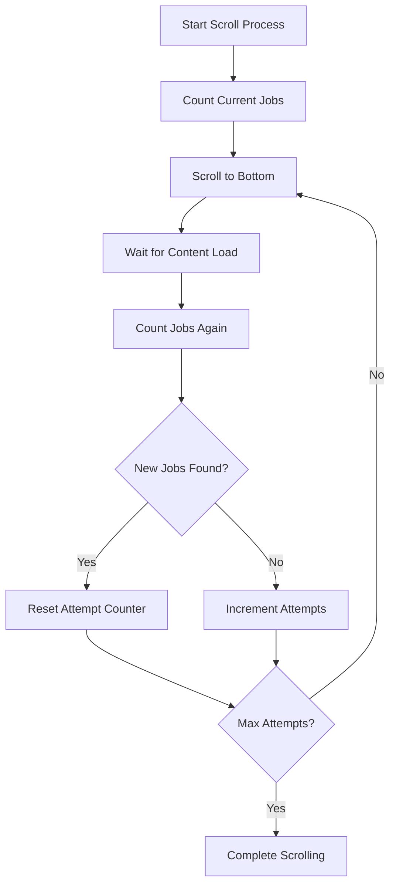

# Common Browser Module Documentation

This document provides an overview of the browser management functions found in the [`role_aggr/scraper/common/browser.py`](../../role_aggr/scraper/common/browser.py) file, detailing their purpose, flow, and browser automation capabilities.

## Overview

The browser module provides core browser automation functionality using Playwright. It handles browser initialization, pagination navigation, job listing extraction, and infinite scroll detection. The module serves as a bridge between the high-level scraping orchestration and low-level browser interactions.

## Browser Management Functions

### [`initialize_playwright_browser()`](../../role_aggr/scraper/common/browser.py:10)

**Purpose:** Initializes a Playwright browser instance with optimized settings for job scraping operations.

**Parameters:**
- `p`: Playwright instance from async_playwright context
- `target_url` (str): The target URL to navigate to
- `show_loading_bar` (bool): Whether to show loading progress

**Flow:**
1. Launches Chromium browser in headless mode
2. Creates browser context with optimized settings:
   - Custom user agent for better compatibility
   - Disabled viewport for resource efficiency
   - JavaScript enabled for dynamic content
   - CSP bypass for broader site compatibility
   - Custom HTTP headers for legitimate request appearance
3. Blocks image and CSS loading for faster page loads
4. Creates new page and navigates to target URL
5. Waits for network idle state or handles timeout gracefully

**Browser Optimization Features:**
- **Resource Blocking:** Images and CSS files blocked for faster loading
- **Custom Headers:** Realistic browser headers to avoid detection
- **Timeout Handling:** Graceful handling of slow-loading pages
- **Error Recovery:** Returns None values on failure for graceful handling

**Returns:** Tuple of (page, browser) or (None, None) on failure

### [`check_pagination_exists()`](../../role_aggr/scraper/common/browser.py:50)

**Purpose:** Determines if a page uses traditional pagination controls or infinite scroll.

**Parameters:**
- `page` (Page): Playwright page object
- `pagination_container_selector` (str): CSS selector for pagination container
- `show_loading_bar` (bool): Whether to show progress feedback

**Flow:**
1. Waits for pagination container with 5-second timeout
2. Returns True if pagination controls found
3. Returns False if timeout occurs (indicating infinite scroll or no pagination)

**Detection Strategy:**
- Uses CSS selector to detect pagination navigation elements
- Short timeout prevents long waits on infinite scroll pages
- Provides clear feedback about pagination type detected

### [`navigate_to_next_page()`](../../role_aggr/scraper/common/browser.py:68)

**Purpose:** Navigates to the next page using pagination controls.

**Parameters:**
- `page` (Page): Playwright page object
- `next_page_button_selector` (str): CSS selector for next page button
- `show_loading_bar` (bool): Whether to show progress feedback

**Flow:**
1. Locates next page button using provided selector
2. Checks if button exists and is not disabled
3. Clicks button and waits for DOM content to load
4. Returns success/failure status

**Navigation Safety:**
- Validates button existence before clicking
- Checks button disabled state to detect end of pagination
- Waits for content load to ensure page readiness
- Handles timeout and navigation errors gracefully

**Returns:** Boolean indicating navigation success

## Job Listing Functions

### [`paginate_through_job_listings()`](../../role_aggr/scraper/common/browser.py:99)

**Purpose:** Controls the pagination process, iterating through pages and accumulating job summaries using provided selectors.

**Parameters:**
- `page` (Page): Playwright page object
- `company_name` (str): Company name for progress reporting
- `target_url` (str): Base URL for job listing
- `job_list_selector` (str): CSS selector for job list container
- `job_item_selector` (str): CSS selector for individual job items
- `job_title_selector` (str): CSS selector for job title links
- `job_posted_date_selector` (str): CSS selector for posted date
- `next_page_button_selector` (str): CSS selector for next page button
- `pagination_container_selector` (str): CSS selector for pagination container
- `max_pages` (Optional[int]): Maximum pages to process
- `show_loading_bar` (bool): Whether to show progress bar

**Flow:**
1. Initializes progress tracking and optional progress bar
2. For each page:
   - Attempts direct job extraction
   - Falls back to scrolling if no jobs found initially
   - Extracts job summaries using [`extract_job_summaries_with_selectors()`](../../role_aggr/scraper/common/processing.py:555)
   - Updates progress indicators
   - Checks for pagination continuation
   - Navigates to next page if available
3. Respects max_pages limit when specified
4. Handles pagination end detection

**Pagination Strategies:**
- **Direct Extraction:** Immediate job summary extraction
- **Scroll Fallback:** Uses [`scroll_to_load_all_jobs()`](../../role_aggr/scraper/common/browser.py:198) for infinite scroll
- **Progress Tracking:** Real-time job count and page progress
- **Limit Enforcement:** Respects maximum page constraints

### [`scroll_to_load_all_jobs()`](../../role_aggr/scraper/common/browser.py:198)

**Purpose:** Handles infinite scroll pages by progressively scrolling to load all available job listings.

**Parameters:**
- `page` (Page): Playwright page object
- `job_list_selector` (str): CSS selector for job list container
- `job_item_selector` (str): CSS selector for individual job items
- `max_scroll_attempts` (int): Maximum scroll attempts before giving up (default: 20)
- `show_loading_bar` (bool): Whether to show progress feedback

**Flow:**
1. Waits for job list container to be present
2. Enters scroll loop with attempt counting:
   - Counts current job items on page
   - Scrolls to bottom of page
   - Waits for content to load (1 second)
   - Compares job count to detect new content
   - Resets attempt counter if new jobs found
   - Increments attempt counter if no new jobs
3. Exits when no new content loads after multiple attempts
4. Returns success status

**Scroll Strategy:**
- **Progressive Loading:** Scrolls to document bottom to trigger loading
- **Change Detection:** Monitors job count to detect new content
- **Attempt Limiting:** Prevents infinite loops on static content
- **Reset Logic:** Resets attempts when new content detected
- **Timeout Handling:** Graceful handling of loading timeouts

**Smart Termination:**
- Stops after 5 consecutive unsuccessful scroll attempts
- Prevents excessive scrolling on pages with limited content
- Provides feedback about total jobs discovered

## Browser Configuration

### Optimization Settings

**Browser Launch Options:**
```javascript
{
  headless: true,
  user_agent: "Mozilla/5.0 (Windows NT 10.0; Win64; x64) AppleWebKit/537.36",
  no_viewport: true,
  java_script_enabled: true,
  bypass_csp: true
}
```

**Resource Blocking:**
- **Images:** `**/*.{png,jpg,jpeg,gif,svg,webp}`
- **Stylesheets:** `**/*.css`

**HTTP Headers:**
```javascript
{
  "Accept": "text/html,application/xhtml+xml,application/xml;q=0.9,image/webp,*/*;q=0.8",
  "Accept-Language": "en-US,en;q=0.5",
  "Connection": "keep-alive",
  "Upgrade-Insecure-Requests": "1"
}
```

## Browser Flow Diagram



## Pagination Detection Flow



## Infinite Scroll Handling



## Error Handling

**Timeout Management:**
- Browser navigation: 20-second timeout with graceful fallback
- Element waiting: 5-15 second timeouts based on operation
- Scroll waiting: 1-second delays between scroll attempts

**Exception Handling:**
- **PlaywrightTimeoutError:** Logged as warnings, processing continues
- **Generic Exceptions:** Logged as errors with full stack traces
- **Navigation Failures:** Browser cleanup and None return values

**Resource Management:**
- Automatic browser context cleanup on failures
- Progressive timeout handling for different operations
- Graceful degradation when elements not found

## Usage Example

```python
from playwright.async_api import async_playwright
from role_aggr.scraper.common.browser import (
    initialize_playwright_browser,
    paginate_through_job_listings
)

async def scrape_jobs():
    async with async_playwright() as p:
        page, browser = await initialize_playwright_browser(
            p, 
            "https://example.com/jobs", 
            show_loading_bar=True
        )
        
        if page and browser:
            job_summaries = await paginate_through_job_listings(
                page=page,
                company_name="Example Corp",
                target_url="https://example.com/jobs",
                job_list_selector="[data-automation-id='jobResults']",
                job_item_selector="li.job-item",
                job_title_selector="a[data-automation-id='jobTitle']",
                job_posted_date_selector="dd[data-automation-id='postedOn']",
                next_page_button_selector="button[aria-label='next']",
                pagination_container_selector="nav[aria-label='pagination']",
                max_pages=5,
                show_loading_bar=True
            )
            
            await browser.close()
            return job_summaries
```

## Dependencies

**External Libraries:**
- `logging`: For operation logging and debugging
- `playwright.async_api`: For browser automation and error handling
- `tqdm`: For progress bar display during operations

**Internal Modules:**
- [`role_aggr.scraper.common.processing`](../../role_aggr/scraper/common/processing.py): Job summary extraction
- [`role_aggr.scraper.common.logging`](../../role_aggr/scraper/common/logging.py): Logging configuration

## Performance Considerations

**Resource Optimization:**
- Images and CSS blocked to reduce bandwidth and load time
- Headless mode for reduced resource consumption
- Network idle waiting for dynamic content loading

**Concurrency Support:**
- Functions designed to work with multiple browser contexts
- Proper cleanup to prevent resource leaks
- Timeout handling to prevent hanging operations

**Scalability Features:**
- Configurable timeout values for different environments
- Progress tracking for long-running operations
- Graceful degradation when resources unavailable