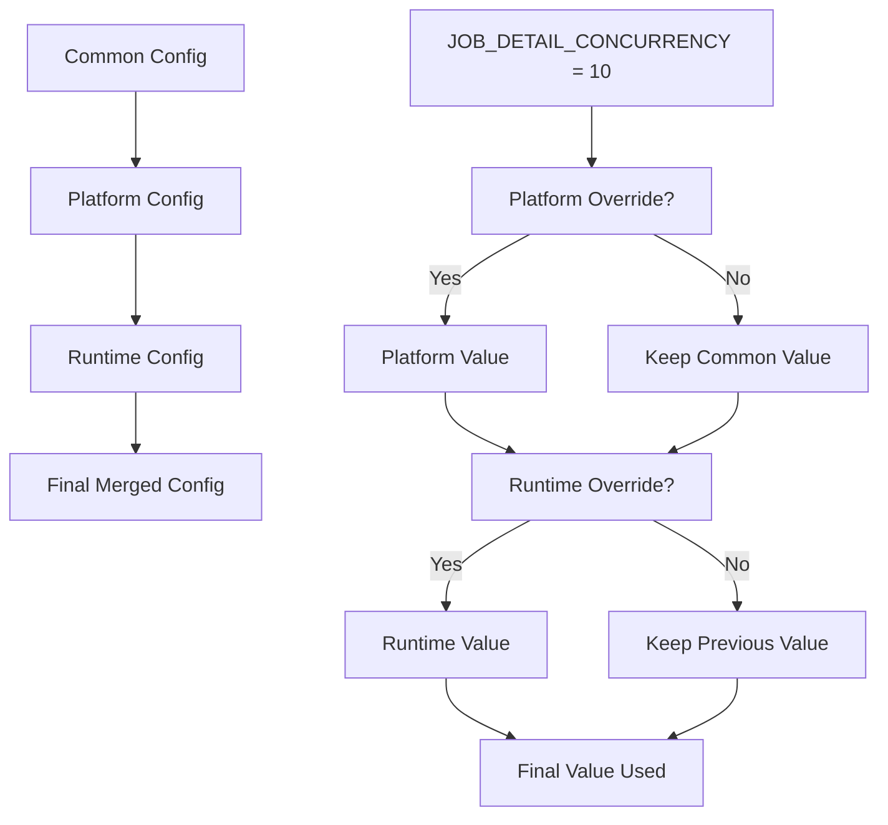

# Common Config Module Documentation

This document provides an overview of the configuration settings found in the [`role_aggr/scraper/common/config.py`](../../role_aggr/scraper/common/config.py) file, detailing the centralized configuration management for the scraper system.

## Overview

The config module provides centralized configuration management for common scraper settings that apply across all platforms. It defines default values and constants that can be used throughout the scraper system.

## Configuration Settings

### [`JOB_DETAIL_CONCURRENCY`](../../role_aggr/scraper/common/config.py:2)

**Purpose:** Controls the maximum number of concurrent job detail fetching operations during parallel processing.

**Value:** `10`

**Usage:** This setting is used by the parallel processing functions in [`role_aggr/scraper/common/processing.py`](../../role_aggr/scraper/common/processing.py) to create an asyncio semaphore that limits concurrent browser contexts.

**Impact on Performance:**
- **Higher Values (15-20):** Faster processing but higher resource usage and potential rate limiting
- **Lower Values (5-8):** Slower processing but more stable and respectful to target servers
- **Current Value (10):** Balanced approach for most scenarios

**Resource Considerations:**
- Each concurrent operation requires a separate browser context
- Memory usage scales linearly with concurrency level
- Network bandwidth and CPU usage increase with higher concurrency

## Configuration Architecture

### Centralized Design

**Benefits:**
- **Single Source of Truth:** All common settings in one location
- **Easy Modification:** Change settings without hunting through multiple files
- **Platform Override:** Platform-specific configs can override these defaults
- **Import Simplicity:** Simple import pattern for all modules

### Platform Integration

**Configuration Hierarchy:**
```python
# 1. Common defaults (this module)
JOB_DETAIL_CONCURRENCY = 10

# 2. Platform-specific overrides
# platforms/workday/config.py can override if needed
JOB_DETAIL_CONCURRENCY = 15  # Platform-specific value

# 3. Runtime configuration
# Factory merges platform config with runtime config
config = {'job_detail_concurrency': 8}  # Runtime override
```

**Merge Strategy:**
The [`ConcreteScraperFactory`](../../role_aggr/scraper/factory.py:26) implements configuration merging:
1. Load common config defaults
2. Load platform-specific config (overrides common)
3. Apply runtime config (overrides platform)

## Usage Patterns

### Standard Import

```python
from role_aggr.scraper.common.config import JOB_DETAIL_CONCURRENCY

# Use in processing functions
semaphore = asyncio.Semaphore(JOB_DETAIL_CONCURRENCY)
```

### Factory Integration

```python
# In factory.py
from .common.config import JOB_DETAIL_CONCURRENCY

def _load_platform_config(self, platform: str) -> Dict[str, Any]:
    # Add general config values with fallback
    if 'job_detail_concurrency' not in config:
        config['job_detail_concurrency'] = JOB_DETAIL_CONCURRENCY
```

### Runtime Override

```python
# Override at runtime through factory
config = {
    'company_name': 'Deutsche Bank',
    'job_detail_concurrency': 15  # Override default
}
scraper = factory.create_scraper('workday', config)
```

## Configuration Categories

### Performance Settings

**Current Settings:**
- `JOB_DETAIL_CONCURRENCY`: Controls parallel processing throughput

**Potential Extensions:**
```python
# Browser settings
BROWSER_TIMEOUT = 60000  # Default browser timeout in ms
PAGE_LOAD_TIMEOUT = 30000  # Page load timeout
ELEMENT_WAIT_TIMEOUT = 10000  # Element wait timeout

# Retry settings
MAX_RETRY_ATTEMPTS = 3  # Maximum retry attempts for failed operations
RETRY_DELAY_BASE = 2  # Base delay for exponential backoff (seconds)
RETRY_DELAY_MAX = 30  # Maximum retry delay (seconds)

# Rate limiting
REQUEST_DELAY = 1000  # Delay between requests (ms)
BURST_LIMIT = 20  # Maximum requests in burst
BURST_WINDOW = 60  # Burst window in seconds
```

### Resource Management

**Potential Settings:**
```python
# Memory management
MAX_BROWSER_CONTEXTS = 50  # Maximum concurrent browser contexts
CONTEXT_CLEANUP_INTERVAL = 300  # Context cleanup interval (seconds)

# File handling
LOG_ROTATION_SIZE = 5 * 1024 * 1024  # 5MB log rotation
LOG_BACKUP_COUNT = 5  # Number of backup log files
CSV_BUFFER_SIZE = 1000  # CSV write buffer size
```

### Platform Defaults

**Common Platform Settings:**
```python
# Selector timeouts
SELECTOR_WAIT_TIMEOUT = 10000  # Default selector wait time
NAVIGATION_TIMEOUT = 30000  # Page navigation timeout
CONTENT_LOAD_TIMEOUT = 20000  # Content loading timeout

# Pagination settings  
MAX_SCROLL_ATTEMPTS = 20  # Maximum scroll attempts for infinite scroll
SCROLL_DELAY = 1000  # Delay between scroll attempts (ms)
PAGE_DELAY = 2000  # Delay between page navigation (ms)
```

## Configuration Flow Diagram



## Environment-Based Configuration

### Development vs Production

**Potential Environment Settings:**
```python
import os

# Environment-based configuration
ENV = os.getenv('SCRAPER_ENV', 'development')

if ENV == 'production':
    JOB_DETAIL_CONCURRENCY = 8  # Conservative for production
    LOG_LEVEL = 'INFO'
    ENABLE_DEBUG_LOGGING = False
elif ENV == 'development':
    JOB_DETAIL_CONCURRENCY = 15  # Aggressive for development
    LOG_LEVEL = 'DEBUG'
    ENABLE_DEBUG_LOGGING = True
elif ENV == 'testing':
    JOB_DETAIL_CONCURRENCY = 3  # Minimal for testing
    LOG_LEVEL = 'WARNING'
    ENABLE_DEBUG_LOGGING = False
```

### Configuration File Support

**Future Enhancement Example:**
```python
import json
import os
from typing import Dict, Any

def load_config_file() -> Dict[str, Any]:
    """Load configuration from external file if available."""
    config_file = os.getenv('SCRAPER_CONFIG_FILE', 'scraper_config.json')
    
    if os.path.exists(config_file):
        with open(config_file, 'r') as f:
            return json.load(f)
    return {}

# Merge file config with defaults
FILE_CONFIG = load_config_file()
JOB_DETAIL_CONCURRENCY = FILE_CONFIG.get('job_detail_concurrency', 10)
```

## Configuration Validation

### Type Safety

**Current Implementation:**
```python
# Simple constant definition
JOB_DETAIL_CONCURRENCY = 10
```

**Enhanced Implementation Example:**
```python
from typing import Union
import logging

def validate_concurrency(value: Union[int, str]) -> int:
    """Validate and convert concurrency setting."""
    try:
        int_value = int(value)
        if int_value < 1:
            logging.warning(f"Concurrency {int_value} too low, using 1")
            return 1
        if int_value > 50:
            logging.warning(f"Concurrency {int_value} too high, using 50")
            return 50
        return int_value
    except (ValueError, TypeError):
        logging.error(f"Invalid concurrency value {value}, using default 10")
        return 10

# Validated configuration
JOB_DETAIL_CONCURRENCY = validate_concurrency(
    os.getenv('JOB_DETAIL_CONCURRENCY', 10)
)
```

## Usage Examples

### Basic Usage

```python
from role_aggr.scraper.common.config import JOB_DETAIL_CONCURRENCY

async def process_jobs():
    semaphore = asyncio.Semaphore(JOB_DETAIL_CONCURRENCY)
    # Use semaphore for concurrency control
```

### Dynamic Configuration

```python
from role_aggr.scraper.common.config import JOB_DETAIL_CONCURRENCY

def get_concurrency_for_platform(platform: str) -> int:
    """Get platform-appropriate concurrency setting."""
    platform_limits = {
        'workday': JOB_DETAIL_CONCURRENCY,
        'greenhouse': max(1, JOB_DETAIL_CONCURRENCY // 2),  # More conservative
        'lever': JOB_DETAIL_CONCURRENCY + 5  # Can handle more
    }
    return platform_limits.get(platform, JOB_DETAIL_CONCURRENCY)
```

### Configuration Monitoring

```python
import logging
from role_aggr.scraper.common.config import JOB_DETAIL_CONCURRENCY

logger = logging.getLogger(__name__)

def log_configuration():
    """Log current configuration for debugging."""
    logger.info(f"Using job detail concurrency: {JOB_DETAIL_CONCURRENCY}")
    
    if JOB_DETAIL_CONCURRENCY > 15:
        logger.warning("High concurrency setting may impact server performance")
    elif JOB_DETAIL_CONCURRENCY < 5:
        logger.warning("Low concurrency setting may slow processing")
```

## Best Practices

### Configuration Management

1. **Use Constants:** Define configuration as module-level constants
2. **Document Impact:** Include comments about performance/resource impact
3. **Provide Defaults:** Always provide sensible default values
4. **Validate Values:** Implement validation for critical settings
5. **Environment Awareness:** Consider different values for different environments

### Platform Integration

1. **Hierarchical Override:** Allow platform-specific overrides
2. **Runtime Flexibility:** Support runtime configuration changes
3. **Backward Compatibility:** Maintain compatibility when adding new settings
4. **Documentation:** Document configuration options and their effects

### Performance Tuning

1. **Monitor Resource Usage:** Track memory, CPU, and network usage
2. **Gradual Adjustment:** Increase concurrency gradually to find optimal values
3. **Platform Testing:** Test different values with different job board platforms
4. **Load Balancing:** Consider server response times and rate limiting

## Dependencies

**External Libraries:**
- None (pure Python constants)

**Internal Dependencies:**
- None (to avoid circular imports in configuration)

**Usage by Other Modules:**
- [`role_aggr.scraper.common.processing`](../../role_aggr/scraper/common/processing.py): Uses `JOB_DETAIL_CONCURRENCY`
- [`role_aggr.scraper.factory`](../../role_aggr/scraper/factory.py): Uses for default configuration merging