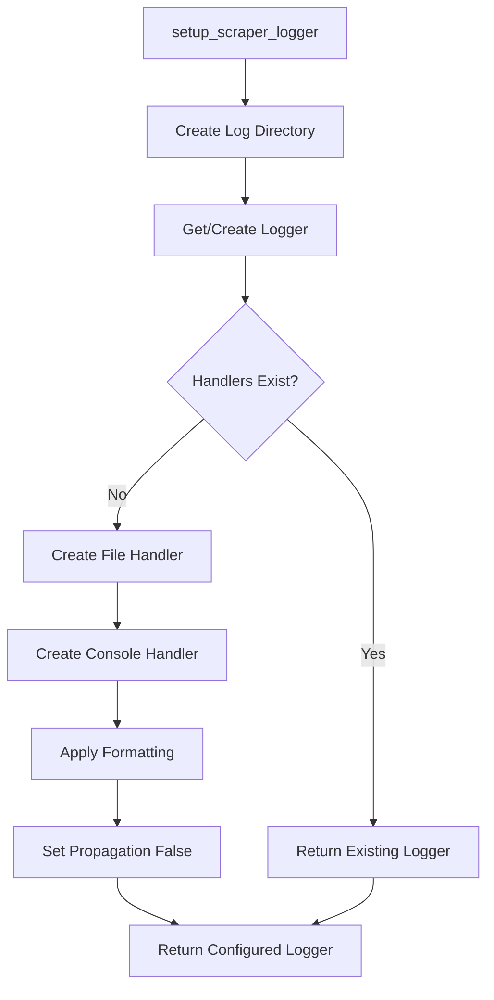
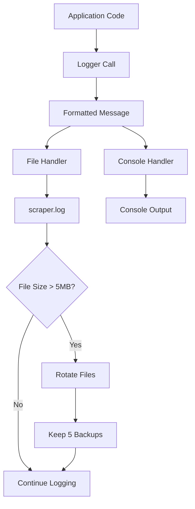

# Common Logging Module Documentation

This document provides an overview of the logging setup function found in the [`role_aggr/scraper/common/logging.py`](../../role_aggr/scraper/common/logging.py) file, detailing its purpose, configuration, and centralized logging approach.

## Overview

The logging module provides centralized logging configuration for the scraper system. It sets up a rotating file logger with both file and console output, ensuring consistent logging behavior across all scraper components.

## Main Function

### [`setup_scraper_logger()`](../../role_aggr/scraper/common/logging.py:5)

**Purpose:** Sets up a rotating file logger for the scraper system with standardized configuration, file rotation, and dual output (file and console).

**Configuration Parameters:**
- **Logger Name:** `'scraper'`
- **Log File Path:** `'role_aggr/logs/scraper/scraper.log'`
- **Log Format:** `'%(asctime)s - %(name)s - %(levelname)s - %(message)s'`
- **Max Log Size:** `5MB (5 * 1024 * 1024 bytes)`
- **Backup Files:** `5 backup files`
- **Default Level:** `logging.INFO`

**Flow:**
1. **Directory Creation:** Ensures log directory exists, creates if missing
2. **Logger Initialization:** Gets or creates logger with specified name
3. **Handler Setup:** Adds both file and console handlers if not already present
4. **File Handler Configuration:**
   - Creates RotatingFileHandler with size and backup limits
   - Applies standardized formatting
   - Sets UTF-8 encoding for international character support
5. **Console Handler Configuration:**
   - Creates StreamHandler for console output
   - Uses same formatting as file handler
6. **Isolation:** Sets `logger.propagate = False` to prevent root logger interference

**Returns:** Configured logger instance ready for use

## Logging Configuration Details

### File Rotation Settings

**Rotation Triggers:**
- **Size-based:** Log files rotate when they exceed 5MB
- **Backup Count:** Maintains up to 5 backup files (scraper.log.1, scraper.log.2, etc.)
- **Automatic Cleanup:** Oldest backup files automatically deleted when limit exceeded

**File Naming Convention:**
```
role_aggr/logs/scraper/scraper.log      # Current log file
role_aggr/logs/scraper/scraper.log.1    # Most recent backup
role_aggr/logs/scraper/scraper.log.2    # Second most recent backup
...
role_aggr/logs/scraper/scraper.log.5    # Oldest backup (auto-deleted when new backup created)
```

### Log Format Structure

**Format String:** `%(asctime)s - %(name)s - %(levelname)s - %(message)s`

**Example Output:**
```
2024-01-15 14:30:25,123 - scraper - INFO - Starting job summary extraction for Deutsche Bank
2024-01-15 14:30:26,456 - scraper - WARNING - Timeout waiting for job listings to load
2024-01-15 14:30:27,789 - scraper - ERROR - Error during pagination: Connection timeout
```

**Format Components:**
- **asctime:** Timestamp with milliseconds
- **name:** Logger name ('scraper')
- **levelname:** Log level (DEBUG, INFO, WARNING, ERROR, CRITICAL)
- **message:** Actual log message

### Dual Output Configuration

**File Handler:**
- **Type:** RotatingFileHandler
- **Encoding:** UTF-8
- **Location:** `role_aggr/logs/scraper/scraper.log`
- **Benefits:** Persistent storage, rotation management, searchable history

**Console Handler:**
- **Type:** StreamHandler (stdout)
- **Benefits:** Real-time monitoring, development debugging, immediate feedback

## Error Handling and Fallbacks

### Directory Creation

**Robust Directory Handling:**
```python
try:
    os.makedirs(log_dir)
except OSError as e:
    print(f"Error creating log directory {log_dir}: {e}")
    # Continue setup - logger might still work with fallbacks
```

**Fallback Strategy:**
- Attempts directory creation with error handling
- Continues logger setup even if directory creation fails
- Allows for potential fallback logging locations

### Handler Setup Protection

**Duplicate Handler Prevention:**
```python
if not logger.handlers:
    # Add handlers only if none exist
```

**Benefits:**
- Prevents duplicate handlers when function called multiple times
- Ensures single handler instances per logger
- Avoids log message duplication

**Individual Handler Error Handling:**
- File handler errors caught and logged to console
- Console handler errors caught and reported
- Logger remains functional even if one handler fails

## Logger Isolation

### Root Logger Prevention

**Propagation Control:**
```python
logger.propagate = False
```

**Purpose:**
- Prevents logs from being passed to root logger
- Ensures clean, controlled logging output
- Avoids interference with other logging configurations

## Usage Patterns

### Standard Usage

```python
from role_aggr.scraper.common.logging import setup_scraper_logger

logger = setup_scraper_logger()

# Logging examples
logger.info("Starting scraping operation")
logger.warning("Timeout occurred, retrying...")
logger.error("Failed to parse job details", exc_info=True)
```

### Module-Level Setup

```python
# At module level
from role_aggr.scraper.common.logging import setup_scraper_logger
logger = setup_scraper_logger()

# Used throughout module
def some_function():
    logger.info("Function started")
    try:
        # Some operation
        pass
    except Exception as e:
        logger.error(f"Error in function: {e}", exc_info=True)
```

### Exception Logging

```python
try:
    # Risky operation
    result = scrape_job_details(url)
except Exception as e:
    logger.error(f"Scraping failed for {url}: {e}", exc_info=True)
    # exc_info=True includes full stack trace
```

## Logging Architecture



## Log Flow Diagram



## Benefits of This Approach

### Centralized Configuration
- Single function configures all scraper logging
- Consistent format across all modules
- Easy to modify logging behavior system-wide

### Automatic Rotation
- Prevents log files from growing too large
- Maintains historical data with backup files
- Automatic cleanup of old log files

### Dual Output
- File logging for persistence and analysis
- Console logging for real-time monitoring
- Same format for both outputs ensures consistency

### Error Resilience
- Graceful handling of directory creation failures
- Individual handler error handling
- Continues operation even with partial failures

### Performance Considerations
- Efficient RotatingFileHandler implementation
- UTF-8 encoding for international character support
- Minimal overhead for production use

## Log Level Usage Guidelines

**INFO Level:**
- Normal operation status
- Progress updates
- Successful completions

**WARNING Level:**
- Recoverable errors
- Timeouts with retry capability
- Missing optional elements

**ERROR Level:**
- Failed operations
- Unrecoverable errors
- Exception conditions with stack traces

**DEBUG Level:**
- Detailed operation information
- Variable values and state
- Development and troubleshooting data

## Example Log Output

```
2024-01-15 14:30:25,123 - scraper - INFO - Starting scraper for Deutsche Bank on platform workday...
2024-01-15 14:30:26,456 - scraper - INFO - Initialized WorkdayScraper for company: Deutsche Bank
2024-01-15 14:30:27,789 - scraper - INFO - Starting pagination for Deutsche Bank at https://db.wd3.myworkdayjobs.com/en-US/DBWebsite
2024-01-15 14:30:28,012 - scraper - INFO - Job list container found, starting extraction
2024-01-15 14:30:29,345 - scraper - INFO - Detected pagination-based job board
2024-01-15 14:30:30,678 - scraper - INFO - Processing page 1
2024-01-15 14:30:31,901 - scraper - INFO - Extracted 25 jobs from page 1
2024-01-15 14:30:33,234 - scraper - WARNING - Timeout loading or finding elements on job detail page: https://example.com/job/123
2024-01-15 14:30:34,567 - scraper - INFO - Pagination complete. Total jobs extracted: 150
```

## Dependencies

**External Libraries:**
- `logging`: Core Python logging functionality
- `os`: For file system operations and directory creation
- `logging.handlers.RotatingFileHandler`: For file rotation management

**No Internal Dependencies:** This module is designed to be self-contained to avoid circular imports in the logging system.