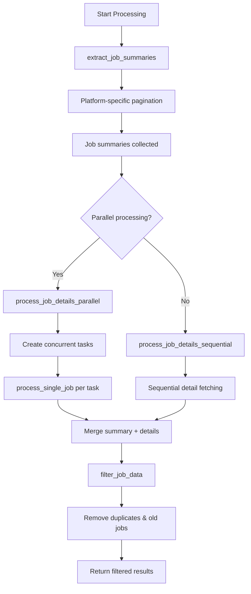
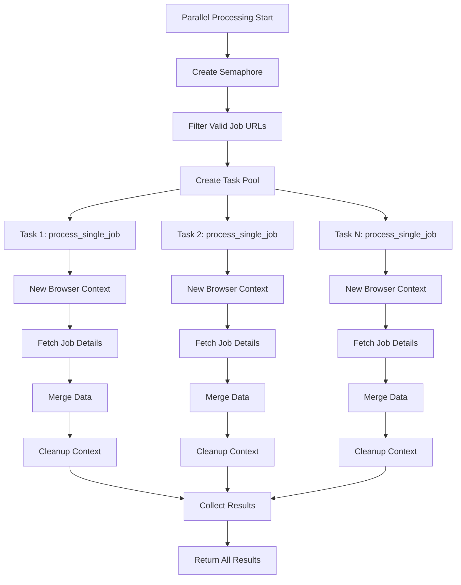
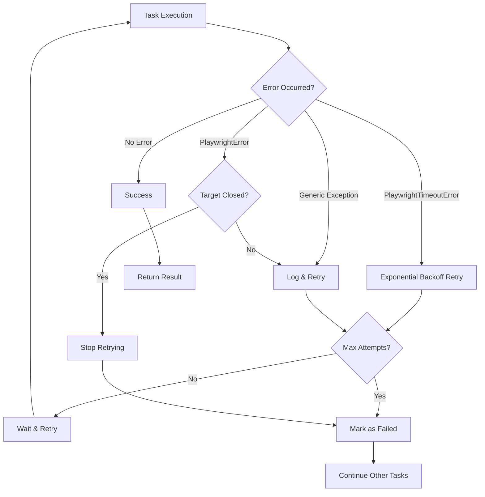

# Common Processing Module Documentation

This document provides an overview of the high-level processing functions found in the [`role_aggr/scraper/common/processing.py`](../../role_aggr/scraper/common/processing.py) file, detailing their purpose, flow, and the refactoring to support platform-agnostic operations.

## Overview

The processing module serves as the orchestration layer for job scraping operations. It has been refactored to implement a generic orchestrator that works with abstract base classes instead of platform-specific logic, providing a clean abstraction layer for different job board platforms.

## Key Refactoring Changes (EIP-001 Task 7)

- **Platform Agnostic:** Functions now accept [`Scraper`](../../role_aggr/scraper/common/base.py:17) instances instead of platform-specific parameters
- **ABC Integration:** All processing functions work with the Scraper ABC interface
- **Backward Compatibility:** Legacy functions preserved during transition period
- **Unified Pipeline:** Complete pipeline processing with consistent error handling

## Main Processing Functions

### [`extract_job_summaries()`](../../role_aggr/scraper/common/processing.py:295)

**Purpose:** Generic orchestrator for extracting job summaries using platform-specific scrapers. This is the main entry point for job summary extraction.

**Parameters:**
- `scraper`: Instance of a platform-specific [`Scraper`](../../role_aggr/scraper/common/base.py:17) (implementing the Scraper ABC)
- `page` (Page): Playwright page object for browser interaction
- `company_name` (str): Name of the company/job board being scraped
- `target_url` (str): Base URL of the job board
- `max_pages` (Optional[int]): Maximum number of pages to scrape
- `show_loading_bar` (bool): Whether to display progress indicators

**Flow:**
1. Validates that scraper implements the [`Scraper`](../../role_aggr/scraper/common/base.py:17) ABC interface
2. Delegates to the platform-specific scraper's [`paginate_through_job_listings()`](../../role_aggr/scraper/common/base.py:34) method
3. Logs extraction progress and results
4. Returns standardized job summary list

**Returns:** List of job summary dictionaries containing standardized job information

### [`process_job_details_parallel()`](../../role_aggr/scraper/common/processing.py:206)

**Purpose:** Fetches job details in parallel using a semaphore to limit concurrency. This is the recommended method for processing job details at scale.

**Parameters:**
- `scraper`: Instance of a platform-specific [`Scraper`](../../role_aggr/scraper/common/base.py:17)
- `browser` (Browser): Playwright browser instance
- `company_name` (str): Name of the company/job board being scraped
- `job_summaries` (List[Dict]): List of job summary dictionaries
- `show_loading_bar` (bool): Whether to display progress indicators

**Flow:**
1. Validates scraper implements the [`Scraper`](../../role_aggr/scraper/common/base.py:17) ABC interface
2. Creates asyncio semaphore with [`JOB_DETAIL_CONCURRENCY`](../../role_aggr/scraper/common/config.py:2) limit
3. Filters job summaries to include only those with valid detail URLs
4. Creates parallel tasks using [`process_single_job()`](../../role_aggr/scraper/common/processing.py:95)
5. Executes tasks with optional progress bar using `tqdm_asyncio`
6. Collects and returns successful results

**Concurrency Control:**
- Uses semaphore to limit concurrent browser contexts
- Configurable via [`JOB_DETAIL_CONCURRENCY`](../../role_aggr/scraper/common/config.py:2) setting
- Handles task failures gracefully without stopping other tasks

### [`process_single_job()`](../../role_aggr/scraper/common/processing.py:95)

**Purpose:** Processes a single job by creating a new browser context, fetching details, and handling retries with exponential backoff.

**Parameters:**
- `scraper`: Instance of a platform-specific [`Scraper`](../../role_aggr/scraper/common/base.py:17)
- `browser` (Browser): Playwright browser instance  
- `job_summary` (Dict): Dictionary containing job summary information
- `company_name` (str): Name of the company/job board being scraped
- `semaphore` (Semaphore): Asyncio semaphore for concurrency control
- `show_loading_bar` (bool): Whether to display progress indicators

**Flow:**
1. Validates job has a valid detail URL
2. Creates isolated browser context for the job
3. Attempts job detail fetching with retry logic (up to 3 attempts)
4. Implements exponential backoff for retries
5. Merges summary and detail data
6. Ensures proper cleanup of browser context and page

**Error Handling:**
- **PlaywrightTimeoutError:** Retries with exponential backoff
- **PlaywrightError:** Handles target closed errors specially
- **Generic Exceptions:** Logs and retries with backoff
- **Cleanup:** Ensures browser context/page closure even on failures

### [`process_job_details_sequential()`](../../role_aggr/scraper/common/processing.py:32)

**Purpose:** Sequential alternative to parallel processing for debugging or when parallel processing causes issues.

**Parameters:**
- `scraper`: Instance of a platform-specific [`Scraper`](../../role_aggr/scraper/common/base.py:17)
- `page` (Page): Playwright page object for browser interaction
- `company_name` (str): Name of the company/job board being scraped
- `job_summaries` (List[Dict]): List of job summary dictionaries
- `show_loading_bar` (bool): Whether to display progress indicators

**Flow:**
1. Iterates through job summaries sequentially
2. Uses single page instance for all job detail fetching
3. Adds small delays between requests (300ms)
4. Merges summary and detail data for each job

### [`filter_job_data()`](../../role_aggr/scraper/common/processing.py:429)

**Purpose:** Filters job data to remove duplicates and jobs posted 30+ days ago.

**Parameters:**
- `job_data_list` (List[Dict]): List of job data dictionaries
- `show_loading_bar` (bool): Whether to display progress indicators

**Flow:**
1. Tracks seen URLs to identify duplicates
2. Filters out jobs posted "30+ days ago"
3. Logs removal statistics
4. Returns filtered job list

**Filtering Criteria:**
- **Duplicates:** Based on job URL
- **Date Filter:** Removes jobs with "posted 30+ days ago" in raw date field

## Complete Pipeline Function

### [`process_jobs_with_scraper()`](../../role_aggr/scraper/common/processing.py:454)

**Purpose:** Complete job processing pipeline that orchestrates the entire scraping process from start to finish.

**Parameters:**
- `scraper`: Instance of a platform-specific [`Scraper`](../../role_aggr/scraper/common/base.py:17)
- `browser` (Browser): Playwright browser instance
- `page` (Page): Playwright page object for browser interaction
- `company_name` (str): Name of the company/job board being scraped
- `target_url` (str): Base URL of the job board
- `max_pages` (Optional[int]): Maximum number of pages to scrape
- `use_parallel_processing` (bool): Whether to use parallel processing for job details
- `show_loading_bar` (bool): Whether to display progress indicators

**Pipeline Flow:**
1. Extract job summaries using [`extract_job_summaries()`](../../role_aggr/scraper/common/processing.py:295)
2. Process job details using parallel or sequential processing
3. Filter results using [`filter_job_data()`](../../role_aggr/scraper/common/processing.py:429)
4. Return complete, filtered job data

## Legacy Functions (Backward Compatibility)

### [`extract_job_summaries_legacy()`](../../role_aggr/scraper/common/processing.py:355)

**Purpose:** Legacy function for extracting job summaries with Workday-specific implementation. Kept for backward compatibility during transition.

**Status:** DEPRECATED - Use [`extract_job_summaries()`](../../role_aggr/scraper/common/processing.py:295) with a Scraper instance instead.

## Processing Flow Diagram



## Parallel Processing Architecture



## Error Handling Strategy



## Configuration

**Concurrency Settings:**
- [`JOB_DETAIL_CONCURRENCY`](../../role_aggr/scraper/common/config.py:2): Maximum concurrent job detail fetching tasks (default: 10)

**Retry Settings:**
- Maximum attempts per job: 3
- Exponential backoff multiplier: 2
- Base delay: 2 seconds

**Timeout Settings:**
- Sequential processing delay: 300ms between jobs

## Usage Example

```python
from role_aggr.scraper.common.processing import process_jobs_with_scraper
from role_aggr.scraper.factory import ConcreteScraperFactory

# Create scraper instance
factory = ConcreteScraperFactory()
scraper = factory.create_scraper('workday', {'company_name': 'Deutsche Bank'})

# Complete pipeline processing
job_data = await process_jobs_with_scraper(
    scraper=scraper,
    browser=browser,
    page=page,
    company_name='Deutsche Bank',
    target_url='https://db.wd3.myworkdayjobs.com/en-US/DBWebsite',
    max_pages=5,
    use_parallel_processing=True,
    show_loading_bar=True
)
```

## Dependencies

**External Libraries:**
- `asyncio`: For asynchronous operations and concurrency control
- `playwright.async_api`: For browser automation and error handling
- `tqdm.asyncio`: For progress bars in async contexts

**Internal Modules:**
- [`role_aggr.scraper.common.config`](../../role_aggr/scraper/common/config.py): Configuration settings
- [`role_aggr.scraper.common.utils`](../../role_aggr/scraper/common/utils.py): Utility functions for parsing
- [`role_aggr.scraper.common.logging`](../../role_aggr/scraper/common/logging.py): Logging setup
- [`role_aggr.scraper.common.base`](../../role_aggr/scraper/common/base.py): Abstract base classes