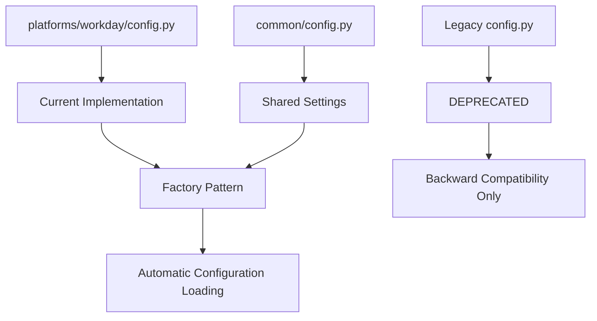

# Legacy Config Module Documentation

This document provides an overview of the legacy configuration found in the [`role_aggr/scraper/config.py`](../role_aggr/scraper/config.py) file, detailing its purpose and relationship to the new modular configuration system.

## Overview

The legacy config module contains Workday-specific configuration that was used before the implementation of the modular platform system. This file is maintained for backward compatibility but has been largely superseded by the platform-specific configuration in [`role_aggr/scraper/platforms/workday/config.py`](platforms/workday/config.md).

## Configuration Settings

### Target URL

#### [`TARGET_URL`](../role_aggr/scraper/config.py:2)

**Purpose:** Legacy target URL for Deutsche Bank's Workday job board.

**Value:** `"https://db.wd3.myworkdayjobs.com/en-US/DBWebsite"`

**Status:** **DEPRECATED** - Use platform-specific configuration instead

### CSS Selectors

The legacy config contains the same Workday-specific selectors that are now properly organized in the platform-specific configuration:

- [`JOB_LIST_SELECTOR`](../role_aggr/scraper/config.py:6): `"ul[data-automation-id='jobResults']"`
- [`JOB_ITEM_SELECTOR`](../role_aggr/scraper/config.py:7): `"li[class='css-1q2dra3']"`
- [`JOB_TITLE_SELECTOR`](../role_aggr/scraper/config.py:8): `"a[data-automation-id='jobTitle']"`
- [`JOB_LOCATION_SELECTOR`](../role_aggr/scraper/config.py:9): `"dd[data-automation-id='locations']"`
- [`JOB_POSTED_DATE_SELECTOR`](../role_aggr/scraper/config.py:13): `"dd[data-automation-id='postedOn']"`

### Job Detail Selectors

- [`JOB_DESCRIPTION_SELECTOR`](../role_aggr/scraper/config.py:16): `"div[data-automation-id='jobPostingDescription']"`
- [`JOB_ID_DETAIL_SELECTOR`](../role_aggr/scraper/config.py:17): `"span[data-automation-id='jobPostingJobId']"`

### Pagination Selectors

- [`PAGINATION_CONTAINER_SELECTOR`](../role_aggr/scraper/config.py:20): `"nav[aria-label='pagination']"`
- [`NEXT_PAGE_BUTTON_SELECTOR`](../role_aggr/scraper/config.py:21): `"button[aria-label='next']"`
- [`PAGE_NUMBER_SELECTOR`](../role_aggr/scraper/config.py:22): `"button[data-uxi-query-id='paginationPageButton']"`

### Performance Settings

- [`JOB_DETAIL_CONCURRENCY`](../role_aggr/scraper/config.py:24): `10`

## Migration Path

### From Legacy to Platform-Specific

**Old Usage:**
```python
from role_aggr.scraper.config import JOB_TITLE_SELECTOR, TARGET_URL
```

**New Usage:**
```python
from role_aggr.scraper.platforms.workday.config import JOB_TITLE_SELECTOR, TARGET_URL
```

### Factory Pattern Integration

**Modern Approach:**
```python
from role_aggr.scraper.factory import ConcreteScraperFactory

# Configuration is automatically loaded by factory
factory = ConcreteScraperFactory()
scraper = factory.create_scraper('workday', {'company_name': 'Deutsche Bank'})
```

## Deprecation Notice

**Status:** This configuration file is **DEPRECATED** and maintained only for backward compatibility.

**Recommended Action:** 
- New implementations should use the platform-specific configuration system
- Existing code should migrate to use the factory pattern
- Direct imports from this module should be avoided

**Removal Timeline:** This legacy configuration will be removed in a future version once all dependent code has been migrated.

## Relationship to Modern Architecture



## Dependencies

**External Libraries:** None

**Internal Dependencies:** None

**Used By:** Legacy code and [`role_aggr/scraper/browser.py`](browser.md) (also deprecated)

## Migration Examples

### Before (Legacy)

```python
from role_aggr.scraper.config import (
    JOB_LIST_SELECTOR,
    JOB_TITLE_SELECTOR,
    TARGET_URL
)

# Manual selector usage
await page.query_selector_all(JOB_LIST_SELECTOR)
```

### After (Modern)

```python
from role_aggr.scraper.factory import ConcreteScraperFactory

# Factory handles configuration automatically
factory = ConcreteScraperFactory()
scraper = factory.create_scraper('workday', {'company_name': 'Example'})

# Scraper handles selectors internally
job_summaries = await scraper.paginate_through_job_listings(page, ...)