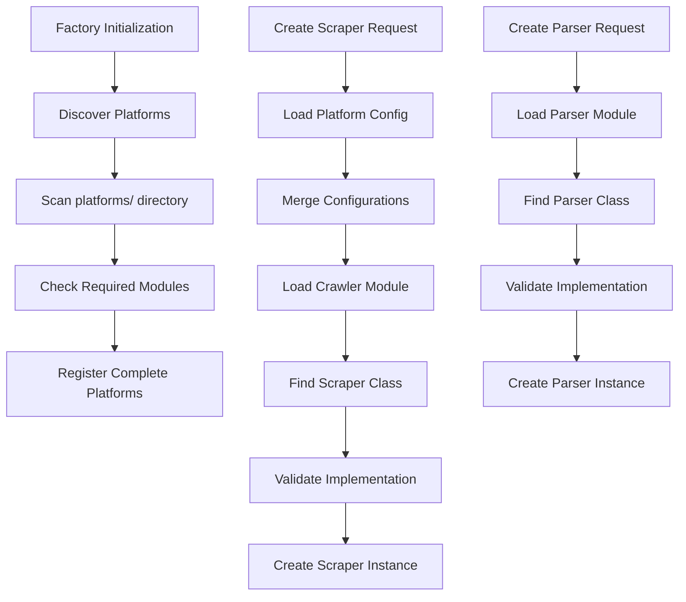
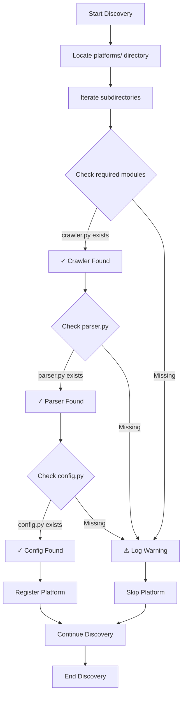

# Scraper Factory Documentation

This document provides an overview of the scraper factory implementation found in the [`role_aggr/scraper/factory.py`](../role_aggr/scraper/factory.py) file, detailing its purpose, architecture, and functionality.

## Overview

The factory module implements the Factory design pattern for creating platform-specific scrapers and parsers. It provides automatic platform discovery, dynamic module loading, and validation of platform implementations through the [`ConcreteScraperFactory`](../role_aggr/scraper/factory.py:26) class.

## Main Class

### [`ConcreteScraperFactory`](../role_aggr/scraper/factory.py:26)

**Purpose:** Concrete implementation of the [`ScraperFactory`](../role_aggr/scraper/common/base.py:207) interface that provides automatic platform discovery, dynamic module loading, and creation of platform-specific scraper and parser instances.

**Key Features:**
- Automatic platform discovery in the platforms/ directory
- Dynamic module loading and validation
- Configuration management with fallback defaults
- Class validation and instantiation with proper error handling

## Core Methods

### [`__init__()`](../role_aggr/scraper/factory.py:35)

**Purpose:** Initializes the factory and discovers available platforms in the platforms directory.

**Flow:**
1. Initializes empty platforms dictionary
2. Calls [`_discover_platforms()`](../role_aggr/scraper/factory.py:40) to find available platform implementations

### [`_discover_platforms()`](../role_aggr/scraper/factory.py:40)

**Purpose:** Automatically discovers available platforms by scanning the platforms/ directory structure.

**Flow:**
1. Locates the platforms directory relative to the factory module
2. Iterates through subdirectories (excluding those starting with '_')
3. Checks for required modules: `crawler`, `parser`, `config`
4. Registers complete platforms in the internal platforms dictionary
5. Logs warnings for incomplete platform implementations

**Platform Structure Expected:**
```
platforms/
├── workday/
│   ├── crawler.py    # Contains Scraper implementation
│   ├── parser.py     # Contains Parser implementation
│   └── config.py     # Contains platform configuration
└── other_platform/
    ├── crawler.py
    ├── parser.py
    └── config.py
```

### [`_load_platform_module()`](../role_aggr/scraper/factory.py:81)

**Purpose:** Dynamically loads a platform-specific module using importlib.

**Parameters:**
- `platform` (str): Platform identifier (e.g., "workday")
- `module_name` (str): Module name to load ("crawler", "parser", "config")

**Flow:**
1. Validates platform is supported
2. Constructs module path using platform and module name
3. Uses `importlib.import_module()` to load the module
4. Handles import errors with descriptive error messages

### [`_load_platform_config()`](../role_aggr/scraper/factory.py:109)

**Purpose:** Loads platform-specific configuration with fallback to general configuration values.

**Flow:**
1. Attempts to load platform-specific config module
2. Extracts all uppercase attributes as configuration values
3. Adds general config values with fallback defaults
4. Returns merged configuration dictionary

**Configuration Handling:**
- Platform-specific: Loaded from `platforms/{platform}/config.py`
- General fallback: Uses [`JOB_DETAIL_CONCURRENCY`](../role_aggr/scraper/common/config.py:2) from common config

### [`_find_class_in_module()`](../role_aggr/scraper/factory.py:141)

**Purpose:** Finds a class in a module that implements the specified base class using reflection.

**Flow:**
1. Uses `inspect.getmembers()` to find all classes in the module
2. Filters for classes that inherit from the base class
3. Excludes the base class itself and imported classes
4. Returns the first matching implementation class

### [`_validate_class_implementation()`](../role_aggr/scraper/factory.py:167)

**Purpose:** Validates that a class properly implements required abstract methods by attempting instantiation.

**Validation Process:**
1. Attempts to create a test instance of the class
2. For [`Scraper`](../role_aggr/scraper/common/base.py:17): Provides test configuration
3. For [`Parser`](../role_aggr/scraper/common/base.py:132): No parameters needed
4. Catches and reports abstract method errors

### [`create_scraper()`](../role_aggr/scraper/factory.py:198)

**Purpose:** Creates a platform-specific scraper instance with merged configuration.

**Flow:**
1. Loads platform configuration using [`_load_platform_config()`](../role_aggr/scraper/factory.py:109)
2. Merges provided config with platform config (provided takes precedence)
3. Loads crawler module using [`_load_platform_module()`](../role_aggr/scraper/factory.py:81)
4. Finds [`Scraper`](../role_aggr/scraper/common/base.py:17) implementation using [`_find_class_in_module()`](../role_aggr/scraper/factory.py:141)
5. Validates implementation using [`_validate_class_implementation()`](../role_aggr/scraper/factory.py:167)
6. Creates and returns configured scraper instance

**Error Handling:**
- `ValueError`: Unsupported platform or configuration issues
- `ImportError`: Missing platform modules

### [`create_parser()`](../role_aggr/scraper/factory.py:243)

**Purpose:** Creates a platform-specific parser instance.

**Flow:**
1. Loads parser module using [`_load_platform_module()`](../role_aggr/scraper/factory.py:81)
2. Finds [`Parser`](../role_aggr/scraper/common/base.py:132) implementation using [`_find_class_in_module()`](../role_aggr/scraper/factory.py:141)
3. Validates implementation using [`_validate_class_implementation()`](../role_aggr/scraper/factory.py:167)
4. Creates and returns parser instance

## Utility Methods

### [`get_supported_platforms()`](../role_aggr/scraper/factory.py:281)

**Purpose:** Returns a list of all supported platform identifiers.

### [`is_platform_supported()`](../role_aggr/scraper/factory.py:290)

**Purpose:** Checks if a specific platform is supported by the factory.

## Factory Workflow Diagram



## Platform Discovery Flow



## Usage Example

```python
from role_aggr.scraper.factory import ConcreteScraperFactory

# Create factory instance
factory = ConcreteScraperFactory()

# Check supported platforms
platforms = factory.get_supported_platforms()
print(f"Supported platforms: {platforms}")

# Create a Workday scraper
config = {'company_name': 'Deutsche Bank'}
scraper = factory.create_scraper('workday', config)

# Create a Workday parser
parser = factory.create_parser('workday')
```

## Error Handling

The factory implements comprehensive error handling for:

- **Missing Platforms:** Logs warnings for incomplete platform implementations
- **Import Errors:** Descriptive error messages for missing modules
- **Validation Errors:** Detailed feedback on abstract method implementation issues
- **Configuration Errors:** Graceful handling of missing or invalid configurations

## Dependencies

**External Libraries:**
- `os`: For file system operations
- `importlib`: For dynamic module loading
- `inspect`: For class reflection and discovery
- `pathlib`: For path operations

**Internal Modules:**
- [`role_aggr.scraper.common.base`](../role_aggr/scraper/common/base.py): Abstract base classes
- [`role_aggr.scraper.common.logging`](../role_aggr/scraper/common/logging.py): Logging setup
- [`role_aggr.scraper.common.config`](../role_aggr/scraper/common/config.py): Common configuration