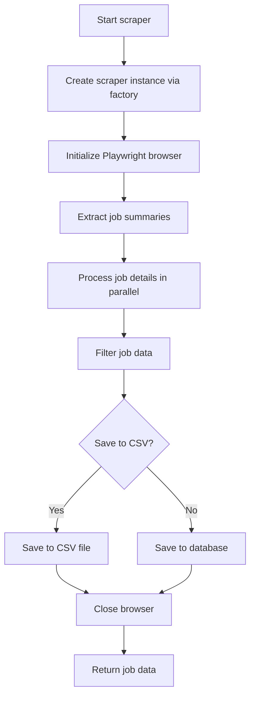

# Scraper Main Module Documentation

This document provides an overview of the main scraper module functions found in the [`role_aggr/scraper/main.py`](../role_aggr/scraper/main.py) file, detailing their purpose, flow, and interdependencies.

## Overview

The main scraper module serves as the primary entry point for job scraping operations. It orchestrates the entire scraping process using platform-specific scrapers through the factory pattern, handles data processing, and manages output to both CSV files and database storage.

## Main Functions

### [`scraper()`](../role_aggr/scraper/main.py:61)

**Purpose:** The primary async function that orchestrates the complete job scraping process from start to finish. It uses platform-specific scrapers via the factory pattern to extract job listings, process details, and save results.

**Parameters:**
- `company_name` (str): The name of the company being scraped
- `target_url` (str): The canonical URL of the job board to scrape
- `platform` (str): The platform hosting the job board (e.g., "workday")
- `max_pages` (int, optional): Maximum number of pages to scrape
- `to_csv` (bool): If True, save to CSV; otherwise save to database
- `output_filename` (str, optional): Filename for CSV output
- `show_loading_bar` (bool): Whether to show progress indicators

**Flow:**
1. Creates a platform-specific scraper instance using [`ConcreteScraperFactory`](../role_aggr/scraper/factory.py:26)
2. Initializes Playwright browser context using [`initialize_playwright_browser()`](../role_aggr/scraper/common/browser.py:10)
3. Extracts job summaries using [`extract_job_summaries()`](../role_aggr/scraper/common/processing.py:295)
4. Processes job details in parallel using [`process_job_details_parallel()`](../role_aggr/scraper/common/processing.py:206)
5. Filters job data using [`filter_job_data()`](../role_aggr/scraper/common/processing.py:429)
6. Saves results to CSV or database based on configuration
7. Ensures browser cleanup in finally block

**Helper Functions Used:**
- [`save_job_listings_data_to_csv()`](../role_aggr/scraper/main.py:20)
- [`save_job_listing_data_to_db()`](../role_aggr/scraper/main.py:44)

**Function Flow Diagram:**



### [`save_job_listings_data_to_csv()`](../role_aggr/scraper/main.py:20)

**Purpose:** Saves extracted job data to a CSV file with proper headers and encoding. Handles both new file creation and appending to existing files.

**Flow:**
1. Checks if output file exists and determines write mode
2. Creates CSV writer with field names from first job data entry
3. Writes header if file is new or empty
4. Writes all job data rows to the file

### [`save_job_listing_data_to_db()`](../role_aggr/scraper/main.py:44)

**Purpose:** Saves job data to the database using the synchronous database functions. Handles the async-to-sync transition for database operations.

**Flow:**
1. Calls [`update_job_listings()`](../role_aggr/database/functions.py) with job data
2. Logs success or failure messages based on database operation results
3. Handles exceptions during database save operations

## Module Configuration

The module uses several configuration elements:

- **Logger Setup:** Configured via [`setup_scraper_logger()`](../role_aggr/scraper/common/logging.py:5)
- **Factory Instance:** Uses [`ConcreteScraperFactory`](../role_aggr/scraper/factory.py:26) for platform-specific scraper creation
- **Browser Management:** Leverages [`initialize_playwright_browser()`](../role_aggr/scraper/common/browser.py:10) for browser setup

## Error Handling

The module implements comprehensive error handling:

- **Factory Errors:** Catches `ValueError` and `ImportError` when creating scraper instances
- **Browser Errors:** Handles browser initialization failures gracefully
- **Processing Errors:** Catches and logs exceptions during scraping process
- **Cleanup:** Ensures browser closure in finally blocks

## Dependencies

**External Libraries:**
- `csv`: For CSV file operations
- `os`: For file system operations
- `asyncio`: For asynchronous operation management
- `playwright.async_api`: For browser automation

**Internal Modules:**
- [`role_aggr.database.functions`](../role_aggr/database/functions.py): Database operations
- [`role_aggr.scraper.common.processing`](../role_aggr/scraper/common/processing.py): Job data processing
- [`role_aggr.scraper.common.browser`](../role_aggr/scraper/common/browser.py): Browser management
- [`role_aggr.scraper.factory`](../role_aggr/scraper/factory.py): Scraper factory
- [`role_aggr.scraper.common.logging`](../role_aggr/scraper/common/logging.py): Logging setup
- [`role_aggr.scraper.common.base`](../role_aggr/scraper/common/base.py): Abstract base classes

## Usage Example

```python
import asyncio
from role_aggr.scraper import scraper

async def main():
    job_data = await scraper(
        company_name="Deutsche Bank",
        target_url="https://db.wd3.myworkdayjobs.com/en-US/DBWebsite",
        platform="workday",
        max_pages=5,
        to_csv=True,
        output_filename="jobs.csv",
        show_loading_bar=True
    )
    print(f"Scraped {len(job_data)} jobs")

asyncio.run(main())