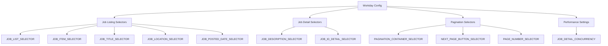

# Workday Config Documentation

This document provides an overview of the Workday-specific configuration settings found in the [`role_aggr/scraper/platforms/workday/config.py`](../../../role_aggr/scraper/platforms/workday/config.py) file, detailing the selectors and settings used for Workday job board scraping.

## Overview

The config module defines Workday-specific CSS selectors and configuration values that are used throughout the Workday scraping implementation. These selectors are based on Workday's consistent use of `data-automation-id` attributes and provide reliable targeting of job board elements.

## Configuration Settings

### Target URL

#### [`TARGET_URL`](../../../role_aggr/scraper/platforms/workday/config.py:2)

**Purpose:** Default target URL for Deutsche Bank's Workday job board (used as example/reference).

**Value:** `"https://db.wd3.myworkdayjobs.com/en-US/DBWebsite"`

**Usage:** Serves as a reference URL pattern for Workday implementations, though actual URLs are typically provided at runtime.

## Job Listing Selectors

### [`JOB_LIST_SELECTOR`](../../../role_aggr/scraper/platforms/workday/config.py:6)

**Purpose:** Targets the main container that holds all job listing items.

**Value:** `"[data-automation-id='jobResults']"`

**Element Description:** The primary container (usually `<ul>` or `<div>`) that contains all individual job listing items.

**Workday Pattern:** Uses Workday's standard `data-automation-id` attribute for reliable element identification.

### [`JOB_ITEM_SELECTOR`](../../../role_aggr/scraper/platforms/workday/config.py:7)

**Purpose:** Targets individual job listing items within the job list container.

**Value:** `"li[class='css-1q2dra3']"`

**Element Description:** Individual job listing containers (typically `<li>` elements) that contain job summary information.

**Note:** CSS class names like `css-1q2dra3` may change between Workday versions, making this selector potentially fragile.

### [`JOB_TITLE_SELECTOR`](../../../role_aggr/scraper/platforms/workday/config.py:8)

**Purpose:** Targets the job title link within each job listing item.

**Value:** `"a[data-automation-id='jobTitle']"`

**Element Description:** The clickable link containing the job title that navigates to the job detail page.

**Data Extracted:**
- Job title (via `inner_text()`)
- Detail page URL (via `href` attribute)

### [`JOB_LOCATION_SELECTOR`](../../../role_aggr/scraper/platforms/workday/config.py:9)

**Purpose:** Targets the location information within job listing items.

**Value:** `"dd[data-automation-id='locations']"`

**Element Description:** Definition list description (`<dd>`) element containing job location information.

**Alternative Selector Available:**
```python
# More generic alternative (commented in config)
JOB_LOCATION_SELECTOR_ALT = "[data-automation-id*='location']"
```

### [`JOB_POSTED_DATE_SELECTOR`](../../../role_aggr/scraper/platforms/workday/config.py:13)

**Purpose:** Targets the job posting date within job listing items.

**Value:** `"dd[data-automation-id='postedOn']"`

**Element Description:** Definition list description (`<dd>`) element containing when the job was posted.

**Date Formats Expected:**
- "Posted today"
- "Posted X days ago"
- "Posted 30+ days ago"
- "Posted on [specific date]"

## Job Detail Page Selectors

### [`JOB_DESCRIPTION_SELECTOR`](../../../role_aggr/scraper/platforms/workday/config.py:16)

**Purpose:** Targets the main job description content on job detail pages.

**Value:** `"div[data-automation-id='jobPostingDescription']"`

**Element Description:** Container element holding the complete job description, requirements, and other detailed information.

**Content Type:** Rich text content including job responsibilities, requirements, qualifications, and benefits.

### [`JOB_ID_DETAIL_SELECTOR`](../../../role_aggr/scraper/platforms/workday/config.py:17)

**Purpose:** Targets the job ID/requisition number on job detail pages.

**Value:** `"span[data-automation-id='jobPostingJobId']"`

**Element Description:** Span element containing the unique job identifier.

**Fallback Strategy:** The code includes a fallback selector for when the primary selector fails:
```python
# Fallback selector used in details.py
"span:has-text('Job Id:') + span"
```

## Pagination Selectors

### [`PAGINATION_CONTAINER_SELECTOR`](../../../role_aggr/scraper/platforms/workday/config.py:20)

**Purpose:** Targets the pagination navigation container to detect pagination presence.

**Value:** `"nav[aria-label='pagination']"`

**Element Description:** Navigation element containing pagination controls (page numbers, next/previous buttons).

**Usage:** Used to determine if the job board uses traditional pagination vs infinite scroll.

### [`NEXT_PAGE_BUTTON_SELECTOR`](../../../role_aggr/scraper/platforms/workday/config.py:21)

**Purpose:** Targets the "next page" button for pagination navigation.

**Value:** `"button[aria-label='next']"`

**Element Description:** Button element that navigates to the next page of job listings.

**Accessibility:** Uses `aria-label` attribute for reliable targeting across different languages.

### [`PAGE_NUMBER_SELECTOR`](../../../role_aggr/scraper/platforms/workday/config.py:22)

**Purpose:** Targets individual page number buttons (for reference/future use).

**Value:** `"button[data-uxi-query-id='paginationPageButton']"`

**Element Description:** Individual page number buttons within the pagination container.

**Usage:** Currently for reference; could be used for direct page navigation in future implementations.

## Performance Settings

### [`JOB_DETAIL_CONCURRENCY`](../../../role_aggr/scraper/platforms/workday/config.py:24)

**Purpose:** Platform-specific override for job detail processing concurrency.

**Value:** `10`

**Usage:** Overrides the common config setting with a Workday-specific value for optimal performance.

**Considerations:**
- Workday servers may have rate limiting
- Higher concurrency may trigger anti-bot measures
- Lower values may be needed for stability

## Selector Design Patterns

### Workday Automation IDs

**Primary Strategy:** Workday consistently uses `data-automation-id` attributes throughout their platform.

**Benefits:**
- **Stable:** Less likely to change than CSS classes
- **Semantic:** Attribute names describe element purpose
- **Consistent:** Same patterns across different companies using Workday

**Pattern Examples:**
```html
<ul data-automation-id="jobResults">
  <li class="css-1q2dra3">
    <a data-automation-id="jobTitle">Software Engineer</a>
    <dd data-automation-id="locations">New York, NY</dd>
    <dd data-automation-id="postedOn">Posted 2 days ago</dd>
  </li>
</ul>
```

### Fallback Strategies

**CSS Class Fallbacks:**
Some selectors use CSS classes as backup when automation IDs are unavailable:

```python
# Primary: data-automation-id (stable)
JOB_ITEM_SELECTOR = "li[data-automation-id='jobItem']"

# Current: CSS class (less stable)
JOB_ITEM_SELECTOR = "li[class='css-1q2dra3']"
```

**Text-Based Fallbacks:**
For job ID extraction, text content is used as fallback:

```python
# Primary selector
JOB_ID_DETAIL_SELECTOR = "span[data-automation-id='jobPostingJobId']"

# Fallback using text content
"span:has-text('Job Id:') + span"
```

## Configuration Architecture



## Usage Patterns

### Import in Workday Modules

```python
# In crawler.py
from .config import (
    JOB_LIST_SELECTOR,
    JOB_ITEM_SELECTOR,
    JOB_TITLE_SELECTOR,
    JOB_LOCATION_SELECTOR,
    JOB_POSTED_DATE_SELECTOR,
    NEXT_PAGE_BUTTON_SELECTOR,
    PAGINATION_CONTAINER_SELECTOR
)

# In parser.py
from .config import (
    JOB_TITLE_SELECTOR,
    JOB_LOCATION_SELECTOR,
    JOB_POSTED_DATE_SELECTOR,
    JOB_DESCRIPTION_SELECTOR,
    JOB_ID_DETAIL_SELECTOR
)
```

### Selector Dictionary Creation

```python
# In WorkdayScraper._extract_job_summaries()
selectors = {
    'job_list_selector': JOB_LIST_SELECTOR,
    'job_item_selector': JOB_ITEM_SELECTOR,
    'job_title_selector': JOB_TITLE_SELECTOR,
    'job_location_selector': JOB_LOCATION_SELECTOR,
    'job_posted_date_selector': JOB_POSTED_DATE_SELECTOR
}
```

### Factory Integration

```python
# In ConcreteScraperFactory._load_platform_config()
config_module = self._load_platform_module('workday', 'config')

# Extract all uppercase attributes as config values
for attr_name in dir(config_module):
    if attr_name.isupper() and not attr_name.startswith('_'):
        config[attr_name.lower()] = getattr(config_module, attr_name)
```

## Selector Validation

### Testing Selector Reliability

```python
async def validate_selectors(page):
    """Validate that Workday selectors work on current page."""
    selectors_to_test = {
        'job_list': JOB_LIST_SELECTOR,
        'job_items': JOB_ITEM_SELECTOR,
        'job_titles': JOB_TITLE_SELECTOR,
        'locations': JOB_LOCATION_SELECTOR,
        'dates': JOB_POSTED_DATE_SELECTOR
    }
    
    results = {}
    for name, selector in selectors_to_test.items():
        try:
            elements = await page.query_selector_all(selector)
            results[name] = len(elements)
        except Exception as e:
            results[name] = f"Error: {e}"
    
    return results
```

### Selector Monitoring

```python
def log_selector_performance(page_results):
    """Log selector performance for monitoring."""
    for selector_name, count in page_results.items():
        if isinstance(count, int):
            logger.info(f"{selector_name}: found {count} elements")
        else:
            logger.warning(f"{selector_name}: {count}")
```

## Customization for Different Workday Instances

### Company-Specific Overrides

```python
# Example: Company-specific selector variations
COMPANY_OVERRIDES = {
    'deutsche_bank': {
        'JOB_ITEM_SELECTOR': "li[class='css-1q2dra3']"  # DB-specific class
    },
    'microsoft': {
        'JOB_ITEM_SELECTOR': "li[class='css-2x4r5t6']"  # MS-specific class
    }
}

def get_selector_for_company(company_name, selector_name):
    """Get company-specific selector override if available."""
    overrides = COMPANY_OVERRIDES.get(company_name.lower(), {})
    return overrides.get(selector_name, globals()[selector_name])
```

### Dynamic Selector Detection

```python
async def detect_job_item_selector(page):
    """Dynamically detect the correct job item selector."""
    potential_selectors = [
        "li[data-automation-id='jobItem']",  # Preferred
        "li[class*='css-']",                 # CSS class fallback
        "div[data-automation-id='jobItem']", # Alternative container
        ".job-item",                         # Generic class
    ]
    
    for selector in potential_selectors:
        try:
            elements = await page.query_selector_all(selector)
            if len(elements) > 0:
                logger.info(f"Using job item selector: {selector}")
                return selector
        except:
            continue
    
    raise Exception("No valid job item selector found")
```

## Maintenance and Updates

### Selector Versioning

```python
# Version-specific selectors for Workday updates
SELECTOR_VERSIONS = {
    'v2023.1': {
        'JOB_ITEM_SELECTOR': "li[class='css-1q2dra3']"
    },
    'v2023.2': {
        'JOB_ITEM_SELECTOR': "li[class='css-2x4r5t6']"
    }
}

def get_selector_for_version(version, selector_name):
    """Get version-specific selector."""
    version_config = SELECTOR_VERSIONS.get(version, {})
    return version_config.get(selector_name, globals()[selector_name])
```

### Automated Selector Testing

```python
def test_all_selectors():
    """Test all selectors against known Workday instances."""
    test_urls = [
        "https://db.wd3.myworkdayjobs.com/en-US/DBWebsite",
        "https://microsoft.wd1.myworkdayjobs.com/en-US/careers",
    ]
    
    for url in test_urls:
        print(f"Testing selectors on: {url}")
        # Automated testing logic here
```

## Dependencies

**External Libraries:**
- None (pure configuration constants)

**Internal Dependencies:**
- None (to avoid circular imports)

**Used By:**
- [`role_aggr.scraper.platforms.workday.crawler`](crawler.md): Main scraper implementation
- [`role_aggr.scraper.platforms.workday.parser`](parser.md): Data parsing functionality
- [`role_aggr.scraper.platforms.workday.details`](details.md): Job detail extraction
- [`role_aggr.scraper.factory`](../../factory.md): Configuration loading

## Best Practices

### Selector Maintenance

1. **Prefer automation-id:** Use `data-automation-id` attributes when available
2. **Avoid CSS classes:** CSS classes change frequently in Workday updates
3. **Use semantic attributes:** `aria-label`, `role`, etc. are more stable
4. **Provide fallbacks:** Include alternative selectors for resilience
5. **Document changes:** Track selector changes across Workday versions

### Performance Optimization

1. **Specific selectors:** Use specific selectors to reduce search scope
2. **Minimize queries:** Combine related data extraction where possible
3. **Cache selectors:** Reuse selector strings across operations
4. **Validate early:** Check selector validity before processing
5. **Monitor performance:** Track selector performance metrics