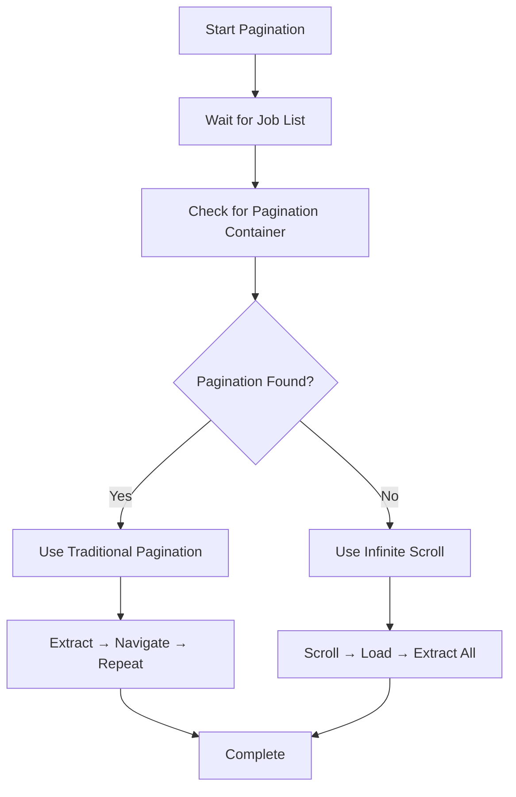
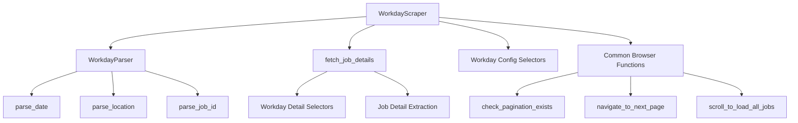

# Workday Crawler Documentation

This document provides an overview of the Workday-specific scraper implementation found in the [`role_aggr/scraper/platforms/workday/crawler.py`](../../../role_aggr/scraper/platforms/workday/crawler.py) file, detailing its purpose, implementation, and Workday-specific features.

## Overview

The crawler module provides the [`WorkdayScraper`](../../../role_aggr/scraper/platforms/workday/crawler.py:37) class that implements the [`Scraper`](../../common/base.md#scraper) interface for scraping job listings from Workday job boards. It handles Workday-specific pagination, job summary extraction, and job detail fetching with knowledge of Workday's HTML structure and behavior patterns.

## Main Class

### [`WorkdayScraper`](../../../role_aggr/scraper/platforms/workday/crawler.py:37)

**Purpose:** Workday-specific implementation of the [`Scraper`](../../common/base.md#scraper) interface that handles the unique HTML structure and pagination behavior of Workday job boards.

**Key Features:**
- Automatic detection of pagination vs infinite scroll
- Workday-specific selector usage
- Integrated parsing with [`WorkdayParser`](../../../role_aggr/scraper/platforms/workday/parser.py:28)
- Robust error handling for Workday-specific issues

**Dependencies:**
- [`WorkdayParser`](../../../role_aggr/scraper/platforms/workday/parser.py:28): For data parsing and cleaning
- [`fetch_job_details`](../../../role_aggr/scraper/platforms/workday/details.py:11): For job detail extraction
- Workday-specific selectors from [`config.py`](../../../role_aggr/scraper/platforms/workday/config.py)

### [`__init__()`](../../../role_aggr/scraper/platforms/workday/crawler.py:46)

**Purpose:** Initializes the Workday scraper with platform-specific configuration and creates a parser instance.

**Flow:**
1. Calls parent [`Scraper`](../../common/base.md#scraper) constructor with configuration
2. Creates a [`WorkdayParser`](../../../role_aggr/scraper/platforms/workday/parser.py:28) instance for data processing
3. Logs initialization with company name for debugging

## Core Methods

### [`paginate_through_job_listings()`](../../../role_aggr/scraper/platforms/workday/crawler.py:57)

**Purpose:** Navigate through Workday job listing pages and extract job summaries, handling both traditional pagination and infinite scroll scenarios.

**Parameters:**
- `page` (Page): Playwright page object for browser interaction
- `company_name` (str): Name of the company/job board being scraped
- `target_url` (str): Base URL of the job board
- `max_pages` (Optional[int]): Maximum number of pages to scrape
- `show_loading_bar` (bool): Whether to display progress indicators

**Flow:**
1. **Initial Setup:** Waits for job list container using [`JOB_LIST_SELECTOR`](../../../role_aggr/scraper/platforms/workday/config.py:6)
2. **Pagination Detection:** Uses [`check_pagination_exists()`](../../common/browser.md#check_pagination_exists) to determine pagination type
3. **Pagination-Based Processing:**
   - Iterates through pages while respecting `max_pages` limit
   - Extracts job summaries from each page using [`_extract_job_summaries()`](../../../role_aggr/scraper/platforms/workday/crawler.py:187)
   - Navigates to next page using [`navigate_to_next_page()`](../../common/browser.md#navigate_to_next_page)
   - Adds 2-second delay between pages for stability
4. **Infinite Scroll Processing:**
   - Uses [`scroll_to_load_all_jobs()`](../../common/browser.md#scroll_to_load_all_jobs) to load all content
   - Extracts all job summaries after scrolling complete

**Workday-Specific Handling:**
- 60-second timeout for job list loading (Workday can be slow)
- Automatic detection between pagination types
- Workday-specific selector configuration

**Returns:** List of job summary dictionaries containing basic job information

### [`fetch_job_details()`](../../../role_aggr/scraper/platforms/workday/crawler.py:146)

**Purpose:** Fetch detailed information from a specific Workday job posting page using Workday-specific selectors and parsing.

**Parameters:**
- `page` (Page): Playwright page object for browser interaction
- `job_url` (str): URL of the specific job detail page
- `show_loading_bar` (bool): Whether to display progress indicators

**Flow:**
1. Delegates to the existing [`fetch_job_details()`](../../../role_aggr/scraper/platforms/workday/details.py:11) function from details.py
2. Applies Workday-specific parsing to the job ID using [`WorkdayParser.parse_job_id()`](../../../role_aggr/scraper/platforms/workday/parser.py:103)
3. Returns standardized job details dictionary

**Error Handling:**
- Catches all exceptions during detail fetching
- Returns fallback dictionary with "N/A" values on failure
- Logs errors with full stack trace for debugging

**Returns:** Dictionary containing detailed job information including description, job ID, and page title

### [`_extract_job_summaries()`](../../../role_aggr/scraper/platforms/workday/crawler.py:186)

**Purpose:** Extract job summary information from the current Workday page using platform-specific selectors and parsing.

**Parameters:**
- `page` (Page): Playwright page object for browser interaction
- `target_url` (str): Base URL for constructing absolute URLs
- `show_loading_bar` (bool): Whether to display progress indicators

**Flow:**
1. **Direct Extraction:**
   - Queries the page for all job listings using [`JOB_ITEM_SELECTOR`](../../../role_aggr/scraper/platforms/workday/config.py:7).
   - Iterates through each job element to extract raw data.
2. **Data Extraction:** For each job element, it extracts:
   - **Title and URL** from the element matching [`JOB_TITLE_SELECTOR`](../../../role_aggr/scraper/platforms/workday/config.py:8).
   - **Location** from the element matching [`JOB_LOCATION_SELECTOR`](../../../role_aggr/scraper/platforms/workday/config.py:9).
   - **Date Posted** from the element matching [`JOB_POSTED_DATE_SELECTOR`](../../../role_aggr/scraper/platforms/workday/config.py:13).
3. **Workday-Specific Parsing:**
   - Parses the extracted raw date string using [`WorkdayParser.parse_date()`](../../../role_aggr/scraper/platforms/workday/parser.py:37).
   - Parses the raw location string using [`WorkdayParser.parse_location()`](../../../role_aggr/scraper/platforms/workday/parser.py:83).

**Returns:** List of job summary dictionaries with parsed data

## Workday-Specific Features

### Pagination Type Detection

**Automatic Detection Strategy:**


### Workday Selectors Integration

**Selector Usage Pattern:**
```python
selectors = {
    'job_list_selector': JOB_LIST_SELECTOR,      # "[data-automation-id='jobResults']"
    'job_item_selector': JOB_ITEM_SELECTOR,      # "li[class='css-1q2dra3']"
    'job_title_selector': JOB_TITLE_SELECTOR,    # "a[data-automation-id='jobTitle']"
    'job_location_selector': JOB_LOCATION_SELECTOR,  # "dd[data-automation-id='locations']"
    'job_posted_date_selector': JOB_POSTED_DATE_SELECTOR  # "dd[data-automation-id='postedOn']"
}
```

### Error Recovery

**Comprehensive Error Handling:**
- **Timeout Errors:** 60-second timeout for slow Workday pages
- **Element Missing:** Graceful handling when job elements not found
- **Navigation Failures:** Continues processing available data
- **Parsing Errors:** Returns original data if parsing fails

## Integration Architecture



## Usage Example

```python
from role_aggr.scraper.platforms.workday.crawler import WorkdayScraper

# Create Workday scraper instance
config = {
    'company_name': 'Deutsche Bank',
    'platform': 'workday'
}
scraper = WorkdayScraper(config)

# Use scraper with Playwright
async with async_playwright() as p:
    browser = await p.chromium.launch()
    page = await browser.new_page()
    await page.goto('https://db.wd3.myworkdayjobs.com/en-US/DBWebsite')
    
    # Extract job summaries
    job_summaries = await scraper.paginate_through_job_listings(
        page=page,
        company_name='Deutsche Bank',
        target_url='https://db.wd3.myworkdayjobs.com/en-US/DBWebsite',
        max_pages=5,
        show_loading_bar=True
    )
    
    # Fetch job details
    if job_summaries:
        job_details = await scraper.fetch_job_details(
            page=page,
            job_url=job_summaries[0]['detail_url'],
            show_loading_bar=True
        )
    
    await browser.close()
```

## Workday Platform Characteristics

### HTML Structure

**Workday-Specific Elements:**
- Uses `data-automation-id` attributes extensively
- Consistent naming conventions across different companies
- Dynamic CSS class names that change between versions
- AJAX-loaded content requiring wait strategies

### Pagination Behavior

**Common Patterns:**
- **Traditional Pagination:** Numbered pages with next/previous buttons
- **Infinite Scroll:** Progressive content loading on scroll
- **Hybrid Approach:** Some sites use both depending on content amount

### Performance Considerations

**Workday-Specific Optimizations:**
- Extended timeouts for slow-loading Workday pages
- Incremental delays between page navigation
- Efficient selector strategies using data-automation-id
- Resource blocking for faster page loads

## Dependencies

**External Libraries:**
- `typing`: For type hints and annotations
- `playwright.async_api`: For browser automation and error handling
- `tqdm`: For progress bar display

**Internal Modules:**
- [`role_aggr.scraper.common.base`](../../common/base.md): Abstract base classes
- [`role_aggr.scraper.common.logging`](../../common/logging.md): Logging configuration
- [`role_aggr.scraper.common.processing`](../../common/processing.md): Job summary extraction
- [`role_aggr.scraper.common.browser`](../../common/browser.md): Browser automation functions
- [`role_aggr.scraper.platforms.workday.config`](config.md): Workday-specific configuration
- [`role_aggr.scraper.platforms.workday.details`](details.md): Job detail extraction
- [`role_aggr.scraper.platforms.workday.parser`](parser.md): Workday data parsing

## Extensibility

### Adding New Workday Features

**Potential Extensions:**
```python
# Additional job metadata extraction
async def extract_job_metadata(self, page):
    """Extract additional Workday-specific metadata."""
    metadata = {}
    
    # Extract job categories/tags
    tags = await page.query_selector_all("div[data-automation-id='pillContainer'] li")
    metadata['tags'] = [await tag.inner_text() for tag in tags]
    
    # Extract salary information if available
    salary_element = await page.query_selector("span[data-automation-id='salary']")
    if salary_element:
        metadata['salary'] = await salary_element.inner_text()
    
    return metadata
```

### Configuration Customization

**Platform-Specific Overrides:**
```python
# Override default concurrency for Workday
def __init__(self, config):
    super().__init__(config)
    # Workday-specific settings
    self.config['job_detail_concurrency'] = 8  # More conservative for Workday
    self.config['page_delay'] = 3000  # Longer delays for Workday
```

### Error Handling Enhancement

**Workday-Specific Error Recovery:**
```python
async def handle_workday_errors(self, page, error):
    """Handle Workday-specific error scenarios."""
    if "blocked" in str(error).lower():
        # Handle IP blocking
        await self.implement_backoff_strategy()
    elif "maintenance" in await page.content():
        # Handle maintenance mode
        raise MaintenanceModeError("Workday in maintenance")