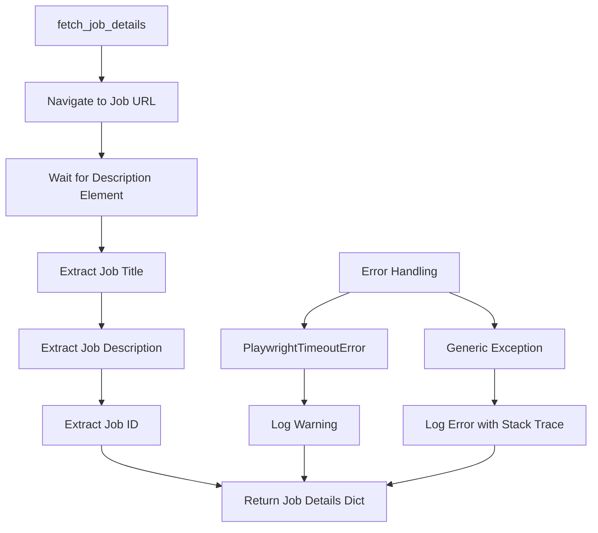

# Workday Details Module Documentation

This document provides an overview of the job detail extraction functionality found in the [`role_aggr/scraper/platforms/workday/details.py`](../../../role_aggr/scraper/platforms/workday/details.py) file, detailing its purpose and implementation for fetching comprehensive job information from Workday job detail pages.

## Overview

The details module provides the [`fetch_job_details()`](../../../role_aggr/scraper/platforms/workday/details.py:11) function that handles extraction of detailed job information from individual Workday job posting pages. It navigates to job detail URLs and extracts comprehensive information including job descriptions, titles, and job IDs using Workday-specific selectors.

## Main Function

### [`fetch_job_details()`](../../../role_aggr/scraper/platforms/workday/details.py:11)

**Purpose:** Fetches and parses detailed information from a single Workday job posting page using Playwright browser automation.

**Parameters:**
- `page` (Page): The Playwright page object for browser interaction
- `job_url` (str): The URL of the job detail page to scrape
- `show_loading_bar` (bool): Whether to show progress feedback (default: False)

**Returns:** Dictionary containing comprehensive job details

**Returned Dictionary Structure:**
```python
{
    "url": str,                    # The job detail page URL
    "description": str,            # Full job description text
    "job_id": str,                 # Platform-specific job identifier
    "detail_page_title": str       # Job title from the detail page
}
```

## Function Flow

### Navigation and Setup

**Page Navigation Process:**
1. **Progress Logging:** Logs navigation start (console or logger based on `show_loading_bar`)
2. **Initialize Default Values:** Creates result dictionary with default "N/A" values
3. **Page Navigation:** Navigates to job URL with 60-second timeout
4. **Content Waiting:** Waits for job description element to ensure page is loaded

**Timeout Configuration:**
- **Page Navigation:** 60 seconds (increased for slow Workday pages)
- **Element Waiting:** 10 seconds for description selector

### Data Extraction

#### Job Title Extraction

**Selector Used:** `"h1[data-automation-id='jobPostingHeader']"`

**Process:**
```python
title_element = await page.query_selector("h1[data-automation-id='jobPostingHeader']")
if title_element:
    job_details["detail_page_title"] = await title_element.inner_text()
```

**Purpose:** Extracts the main job title as displayed on the detail page header.

#### Job Description Extraction

**Selector Used:** [`JOB_DESCRIPTION_SELECTOR`](../../../role_aggr/scraper/platforms/workday/config.py:16) (`"div[data-automation-id='jobPostingDescription']"`)

**Process:**
```python
description_element = await page.query_selector(JOB_DESCRIPTION_SELECTOR)
if description_element:
    job_details["description"] = await description_element.inner_text()
```

**Content Extracted:**
- Job responsibilities and duties
- Required qualifications and skills
- Preferred qualifications
- Company information and benefits
- Application instructions

**Text Format:** Plain text content (HTML formatting removed by `inner_text()`)

#### Job ID Extraction

**Primary Selector:** [`JOB_ID_DETAIL_SELECTOR`](../../../role_aggr/scraper/platforms/workday/config.py:17) (`"span[data-automation-id='jobPostingJobId']"`)

**Fallback Selector:** `"span:has-text('Job Id:') + span"`

**Process:**
```python
job_id_element = await page.query_selector(JOB_ID_DETAIL_SELECTOR)
if not job_id_element:  # Fallback strategy
    job_id_element = await page.query_selector("span:has-text('Job Id:') + span")
if job_id_element:
    job_details["job_id"] = (await job_id_element.inner_text()).strip()
```

**Fallback Strategy:** If primary selector fails, looks for text containing "Job Id:" and selects the adjacent span element.

## Error Handling

### Exception Types Handled

#### PlaywrightTimeoutError

**Scenario:** Page navigation or element loading times out

**Handling:**
```python
except PlaywrightTimeoutError:
    logger.warning(f"Timeout loading or finding elements on job detail page: {job_url}")
```

**Response:** Logs warning and returns partial data with "N/A" values for missing fields

#### Generic Exceptions

**Scenario:** Any other error during page processing

**Handling:**
```python
except Exception as e:
    logger.error(f"Error processing job detail page {job_url}: {e}", exc_info=True)
```

**Response:** Logs full error with stack trace and returns default dictionary

### Graceful Degradation

**Default Return Values:**
```python
job_details = {
    "url": job_url,                # Always available
    "description": "N/A",          # Default if extraction fails
    "job_id": "N/A",              # Default if extraction fails
    "detail_page_title": "N/A"    # Default if extraction fails
}
```

**Philosophy:** Always return a valid dictionary structure, even on complete failure, to maintain processing pipeline stability.

## Integration Architecture



## Usage Patterns

### Integration with WorkdayScraper

```python
# In WorkdayScraper.fetch_job_details()
async def fetch_job_details(self, page, job_url, show_loading_bar=False):
    # Use the existing fetch_job_details function
    job_details = await fetch_job_details(page, job_url, show_loading_bar)
    
    # Apply additional parsing
    if job_details.get('job_id'):
        job_details['job_id'] = self.parser.parse_job_id(job_details['job_id'])
    
    return job_details
```

### Parallel Processing Integration

```python
# In process_single_job()
detail_data = await scraper.fetch_job_details(
    page=page,
    job_url=job_url,
    show_loading_bar=show_loading_bar
)

# Merge with summary data
full_job_info = {**job_summary, **detail_data}
```

### Direct Usage

```python
from role_aggr.scraper.platforms.workday.details import fetch_job_details

async def extract_single_job(page, job_url):
    job_details = await fetch_job_details(
        page=page,
        job_url=job_url,
        show_loading_bar=True
    )
    
    print(f"Title: {job_details['detail_page_title']}")
    print(f"Job ID: {job_details['job_id']}")
    print(f"Description: {job_details['description'][:200]}...")
    
    return job_details
```

## Data Flow Diagram

```mermaid
graph TD
    A[Job URL] --> B[fetch_job_details]
    B --> C[Navigate to Page]
    C --> D{Page Load Success?}
    D -->|Yes| E[Extract Title]
    D -->|No| F[Timeout Error]
    E --> G[Extract Description]
    G --> H[Extract Job ID]
    H --> I{Primary Selector Works?}
    I -->|Yes| J[Use Primary Job ID]
    I -->|No| K[Try Fallback Selector]
    K --> L{Fallback Works?}
    L -->|Yes| M[Use Fallback Job ID]
    L -->|No| N[Use Default "N/A"]
    J --> O[Return Complete Details]
    M --> O
    N --> O
    F --> P[Return Partial Details]
```

## Workday-Specific Considerations

### Page Load Characteristics

**Workday Loading Patterns:**
- Heavy JavaScript usage requiring content wait strategies
- Dynamic content loading after initial page load
- Potential for slow response times from Workday servers

**Optimization Strategies:**
- Extended timeouts (60s for navigation, 10s for elements)
- Wait for specific content elements rather than generic page load
- Progressive fallback selectors for different Workday versions

### Element Reliability

**Selector Stability:**
- `data-automation-id` attributes are most reliable
- Fallback to text-based selectors when needed
- Graceful handling when elements are missing

**Content Variations:**
- Job descriptions may contain rich formatting
- Job IDs may have various prefix patterns
- Titles may include location or department information

## Performance Considerations

### Resource Usage

**Browser Resource Management:**
- Function operates on existing page instance
- No additional browser context creation
- Efficient element querying with specific selectors

**Network Efficiency:**
- Single page navigation per call
- Minimal element queries (only what's needed)
- Text extraction without unnecessary resource loading

### Error Recovery

**Timeout Handling:**
- Prevents hanging on slow pages
- Allows processing to continue with partial data
- Maintains overall scraping pipeline flow

**Memory Management:**
- No persistent state between calls
- Immediate cleanup of element references
- Minimal object creation during extraction

## Extensibility

### Additional Data Extraction

```python
# Enhanced version with additional fields
async def fetch_job_details_enhanced(page, job_url, show_loading_bar=False):
    # Standard extraction
    job_details = await fetch_job_details(page, job_url, show_loading_bar)
    
    # Additional extractions
    try:
        # Extract salary information
        salary_element = await page.query_selector("span[data-automation-id='salary']")
        if salary_element:
            job_details["salary"] = await salary_element.inner_text()
        
        # Extract job categories/tags
        tag_elements = await page.query_selector_all("div[data-automation-id='pillContainer'] li")
        job_details["tags"] = [await tag.inner_text() for tag in tag_elements]
        
        # Extract application deadline
        deadline_element = await page.query_selector("span[data-automation-id='applicationDeadline']")
        if deadline_element:
            job_details["application_deadline"] = await deadline_element.inner_text()
            
    except Exception as e:
        logger.warning(f"Error extracting additional details: {e}")
    
    return job_details
```

### Custom Selector Support

```python
async def fetch_job_details_custom(page, job_url, custom_selectors=None, show_loading_bar=False):
    """Enhanced version with custom selector support."""
    selectors = {
        'title': "h1[data-automation-id='jobPostingHeader']",
        'description': JOB_DESCRIPTION_SELECTOR,
        'job_id': JOB_ID_DETAIL_SELECTOR,
        **(custom_selectors or {})
    }
    
    job_details = {"url": job_url}
    
    await page.goto(job_url, wait_until="domcontentloaded", timeout=60000)
    
    for field, selector in selectors.items():
        try:
            element = await page.query_selector(selector)
            if element:
                job_details[field] = await element.inner_text()
            else:
                job_details[field] = "N/A"
        except Exception as e:
            logger.warning(f"Error extracting {field}: {e}")
            job_details[field] = "N/A"
    
    return job_details
```

### Multi-Language Support

```python
async def fetch_job_details_multilingual(page, job_url, locale='en', show_loading_bar=False):
    """Version with multi-language support."""
    locale_selectors = {
        'en': {
            'job_id_fallback': "span:has-text('Job Id:') + span"
        },
        'es': {
            'job_id_fallback': "span:has-text('ID del trabajo:') + span"
        },
        'fr': {
            'job_id_fallback': "span:has-text('ID d\\'emploi:') + span"
        }
    }
    
    # Use locale-specific selectors
    selectors = locale_selectors.get(locale, locale_selectors['en'])
    
    # Continue with locale-aware extraction...
```

## Dependencies

**External Libraries:**
- `playwright.async_api`: For browser automation, page navigation, and element interaction

**Internal Modules:**
- [`role_aggr.scraper.platforms.workday.config`](config.md): Workday-specific selectors
- [`role_aggr.scraper.common.logging`](../../common/logging.md): Logging configuration

**Integration Points:**
- [`role_aggr.scraper.platforms.workday.crawler`](crawler.md): Used by WorkdayScraper.fetch_job_details()
- [`role_aggr.scraper.common.processing`](../../common/processing.md): Used in parallel processing functions

## Testing Considerations

### Unit Testing

```python
import pytest
from unittest.mock import AsyncMock

async def test_fetch_job_details_success():
    # Mock page and elements
    page = AsyncMock()
    title_element = AsyncMock()
    title_element.inner_text.return_value = "Software Engineer"
    description_element = AsyncMock()
    description_element.inner_text.return_value = "Job description here"
    
    page.query_selector.side_effect = [title_element, description_element, None]
    
    result = await fetch_job_details(page, "https://example.com/job/123")
    
    assert result["detail_page_title"] == "Software Engineer"
    assert result["description"] == "Job description here"
    assert result["job_id"] == "N/A"  # No job ID element found
```

### Integration Testing

```python
async def test_fetch_job_details_integration():
    """Test with real Workday page."""
    async with async_playwright() as p:
        browser = await p.chromium.launch()
        page = await browser.new_page()
        
        result = await fetch_job_details(
            page, 
            "https://db.wd3.myworkdayjobs.com/en-US/DBWebsite/job/London/Software-Engineer_123456"
        )
        
        assert result["url"] == "https://db.wd3.myworkdayjobs.com/en-US/DBWebsite/job/London/Software-Engineer_123456"
        assert result["description"] != "N/A"  # Should extract description
        
        await browser.close()
```

### Error Testing

```python
async def test_fetch_job_details_timeout():
    """Test timeout handling."""
    page = AsyncMock()
    page.goto.side_effect = PlaywrightTimeoutError("Navigation timeout")
    
    result = await fetch_job_details(page, "https://example.com/job/timeout")
    
    assert result["url"] == "https://example.com/job/timeout"
    assert result["description"] == "N/A"
    assert result["job_id"] == "N/A"
    assert result["detail_page_title"] == "N/A"