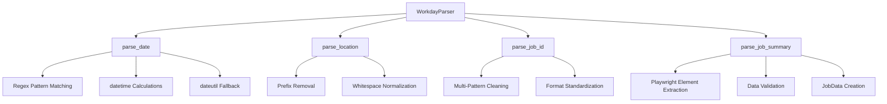
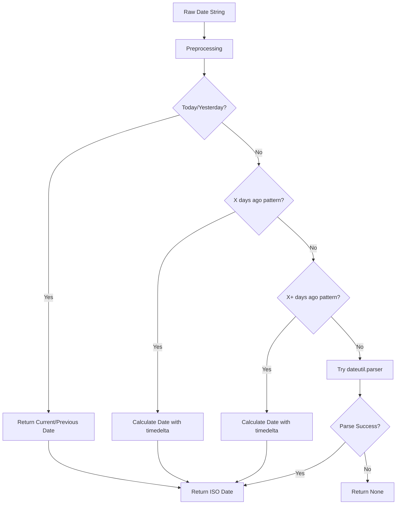

# Workday Parser Documentation

This document provides an overview of the Workday-specific parser implementation found in the [`role_aggr/scraper/platforms/workday/parser.py`](../../../role_aggr/scraper/platforms/workday/parser.py) file, detailing its purpose, parsing capabilities, and Workday-specific data handling.

## Overview

The parser module provides the [`WorkdayParser`](../../../role_aggr/scraper/platforms/workday/parser.py:28) class that implements the [`Parser`](../../common/base.md#parser) interface for parsing job data from Workday job boards. It handles Workday-specific date formats, location strings, job IDs, and provides Playwright-based HTML element extraction capabilities.

## Main Class

### [`WorkdayParser`](../../../role_aggr/scraper/platforms/workday/parser.py:28)

**Purpose:** Workday-specific implementation of the [`Parser`](../../common/base.md#parser) interface that handles the unique HTML structure and data formats used by Workday job boards.

**Key Features:**
- Comprehensive date format support (relative and absolute)
- Workday-specific location string cleaning
- Job ID extraction and normalization
- Playwright-based job summary parsing
- Robust error handling with fallbacks

**Workday-Specific Knowledge:**
- Workday's relative date patterns ("Posted today", "Posted X days ago")
- Location prefix patterns ("Locations:", case variations)
- Job ID formats (with "Job ID:", "REQ-" prefixes)
- HTML structure using `data-automation-id` attributes

## Parsing Methods

### [`parse_date()`](../../../role_aggr/scraper/platforms/workday/parser.py:37)

**Purpose:** Parse Workday-specific date strings into standardized ISO format, handling both relative and absolute date formats.

**Parameters:**
- `date_str_raw` (str): Raw date string from Workday job listing

**Returns:** ISO format date string (YYYY-MM-DD) or None if parsing fails

**Supported Formats:**

#### Relative Dates
```python
"Posted today" → "2024-01-15" (current date)
"Just posted" → "2024-01-15" (current date)
"Posted yesterday" → "2024-01-14" (yesterday)
"Posted 3 days ago" → "2024-01-12" (3 days ago)
"Posted 30+ days ago" → "2023-12-16" (30 days ago, handles plus notation)
```

#### Absolute Dates
```python
"Posted Jan 15, 2024" → "2024-01-15"
"Posted 01/15/2024" → "2024-01-15"
"Posted on January 15, 2024" → "2024-01-15"
```

**Parsing Flow:**
1. **Input Validation:** Returns None for empty input
2. **Preprocessing:** Converts to lowercase, strips whitespace, removes "posted on" prefix
3. **Pattern Matching:** Uses regex patterns for relative dates
4. **Date Calculation:** Uses `datetime` and `timedelta` for relative date arithmetic
5. **Fallback Parsing:** Uses `dateutil.parser` for complex absolute dates
6. **Error Handling:** Returns None if all parsing attempts fail

**Regex Patterns:**
```python
r'posted\s+(\d+)\s+days?\s+ago'    # Standard "X days ago"
r'posted\s*(\d+)\+\s*days?\s*ago'  # Plus notation "X+ days ago"
```

### [`parse_location()`](../../../role_aggr/scraper/platforms/workday/parser.py:83)

**Purpose:** Parse and clean Workday location strings by removing platform-specific prefixes and normalizing whitespace.

**Parameters:**
- `location_str_raw` (str): Raw location string from Workday job listing

**Returns:** Cleaned location string

**Cleaning Operations:**
1. **Input Validation:** Returns empty string for falsy input
2. **Prefix Removal:** Removes "locations" prefix (case-insensitive) with optional colon
3. **Whitespace Normalization:** Strips leading and trailing whitespace

**Regex Pattern:**
```python
r'^\s*locations\s*:?\s*'  # Matches "locations" prefix with optional colon and whitespace
```

**Example Transformations:**
```python
"Locations: New York, NY" → "New York, NY"
"LOCATIONS   London, UK" → "London, UK"
"locations:San Francisco, CA" → "San Francisco, CA"
"Remote - United States" → "Remote - United States"  # No change needed
```

### [`parse_job_id()`](../../../role_aggr/scraper/platforms/workday/parser.py:103)

**Purpose:** Parse and extract job ID from Workday-specific formats by removing common prefixes and normalizing the identifier.

**Parameters:**
- `job_id_raw` (str): Raw job ID string from Workday job detail page

**Returns:** Cleaned job ID string

**Cleaning Operations:**
1. **Input Validation:** Returns empty string for falsy input
2. **Whitespace Normalization:** Strips leading and trailing whitespace
3. **Prefix Removal:** Removes common Workday job ID prefixes
4. **Format Normalization:** Handles various job ID formats

**Supported Patterns:**
```python
# Job ID prefix removal (case-insensitive)
r'^job\s*id\s*:?\s*'  # Removes "Job ID:" prefix

# REQ prefix removal (common Workday format)
r'^req-?'  # Removes "REQ-" or "REQ" prefix
```

**Example Transformations:**
```python
"Job ID: 12345" → "12345"
"JOB ID:67890" → "67890"
"REQ-2024-001" → "2024-001"
"REQ123456" → "123456"
"ABC-DEF-123" → "ABC-DEF-123"  # No change if no known prefix
```

## Advanced Parsing Methods

### [`parse_job_summary()`](../../../role_aggr/scraper/platforms/workday/parser.py:130)

**Purpose:** Parse comprehensive job summary data from Workday page using Playwright for HTML element extraction.

**Parameters:**
- `page` (Page): Playwright page object containing the job listing/detail
- `base_url` (str): Base URL for constructing absolute URLs

**Returns:** [`JobData`](../../common/base.md#jobdata) object with parsed information or None if parsing fails

**Extraction Process:**
1. **Title Extraction:** Uses [`JOB_TITLE_SELECTOR`](../../../role_aggr/scraper/platforms/workday/config.py:8)
2. **URL Construction:** Builds absolute URLs from relative links
3. **Location Processing:** Extracts and parses using [`JOB_LOCATION_SELECTOR`](../../../role_aggr/scraper/platforms/workday/config.py:9)
4. **Date Processing:** Extracts and parses using [`JOB_POSTED_DATE_SELECTOR`](../../../role_aggr/scraper/platforms/workday/config.py:13)
5. **Description Extraction:** Uses [`JOB_DESCRIPTION_SELECTOR`](../../../role_aggr/scraper/platforms/workday/config.py:16) if available
6. **Job ID Extraction:** Uses [`JOB_ID_DETAIL_SELECTOR`](../../../role_aggr/scraper/platforms/workday/config.py:17) if available
7. **Data Validation:** Ensures required fields are present
8. **Object Creation:** Creates [`JobData`](../../common/base.md#jobdata) instance with parsed data

**URL Construction Logic:**
```python
if href.startswith('http'):
    detail_url = href                    # Already absolute
elif href.startswith('/'):
    detail_url = base_url.rstrip('/') + href  # Add base URL
else:
    detail_url = f"{base_url.rstrip('/')}/{href}"  # Add base URL with separator
```

**Data Validation:**
- Requires job title to be present
- Returns None if essential data missing
- Includes both raw and parsed data for debugging

## Legacy Wrapper Functions

### [`parse_relative_date()`](../../../role_aggr/scraper/platforms/workday/parser.py:213)

**Purpose:** Legacy wrapper function for backward compatibility during transition period.

**Usage:** Provides the same interface as the original utility function while using the new parser implementation.

```python
def parse_relative_date(date_str_raw: str) -> Optional[str]:
    parser = WorkdayParser()
    return parser.parse_date(date_str_raw)
```

### [`parse_location()`](../../../role_aggr/scraper/platforms/workday/parser.py:227)

**Purpose:** Legacy wrapper function for backward compatibility during transition period.

```python
def parse_location(location_str_raw: str) -> str:
    parser = WorkdayParser()
    return parser.parse_location(location_str_raw)
```

## Parser Architecture



## Date Parsing Flow



## Error Handling Strategy

### Graceful Degradation

**Date Parsing Errors:**
```python
try:
    return parse_date(cleaned_date_str).date().isoformat()
except Exception as e:
    logger.warning(f"Could not parse date '{date_str_raw}': {e}")
    return None
```

**Job Summary Parsing Errors:**
```python
try:
    # Extract and parse job data
    job_data = JobData(...)
    return job_data
except Exception as e:
    logger.error(f"Error parsing job summary from page: {e}")
    return None
```

### Input Validation

**Defensive Programming:**
- Checks for None/empty inputs
- Validates page object existence
- Ensures required fields are present
- Provides meaningful error messages

## Integration with Workday Selectors

### Selector Usage

**Job Summary Extraction:**
```python
# Title and URL extraction
title_element = await page.query_selector(JOB_TITLE_SELECTOR)
href = await title_element.get_attribute('href')

# Location extraction
location_element = await page.query_selector(JOB_LOCATION_SELECTOR)
location_raw = await location_element.inner_text()

# Date extraction
date_element = await page.query_selector(JOB_POSTED_DATE_SELECTOR)
date_raw = await date_element.inner_text()
```

**Detail Page Extraction:**
```python
# Description extraction
description_element = await page.query_selector(JOB_DESCRIPTION_SELECTOR)
description = await description_element.inner_text()

# Job ID extraction
job_id_element = await page.query_selector(JOB_ID_DETAIL_SELECTOR)
job_id_raw = await job_id_element.inner_text()
```

## Usage Examples

### Basic Parsing

```python
from role_aggr.scraper.platforms.workday.parser import WorkdayParser

parser = WorkdayParser()

# Date parsing
date_iso = parser.parse_date("Posted 3 days ago")
print(date_iso)  # "2024-01-12"

# Location parsing
clean_location = parser.parse_location("Locations: New York, NY")
print(clean_location)  # "New York, NY"

# Job ID parsing
clean_id = parser.parse_job_id("Job ID: 12345")
print(clean_id)  # "12345"
```

### Playwright Integration

```python
async def extract_job_data(page, base_url):
    parser = WorkdayParser()
    
    # Parse complete job summary
    job_data = await parser.parse_job_summary(page, base_url)
    
    if job_data:
        print(f"Title: {job_data.title}")
        print(f"Location: {job_data.location}")
        print(f"Date: {job_data.date_posted}")
        print(f"URL: {job_data.detail_url}")
    
    return job_data
```

### Integration with Crawler

```python
# In WorkdayScraper._extract_job_summaries()
for summary in job_summaries:
    if summary.get('date_posted_raw'):
        summary['date_posted_parsed'] = self.parser.parse_date(
            summary['date_posted_raw']
        )
    
    if summary.get('location_raw'):
        summary['location_parsed'] = self.parser.parse_location(
            summary['location_raw']
        )
```

## Workday-Specific Considerations

### Date Format Variations

**Common Workday Patterns:**
- Relative dates are most common ("Posted today", "Posted X days ago")
- Plus notation indicates approximate dates ("30+ days ago")
- Absolute dates typically use month names ("Posted Jan 15, 2024")

### Location Format Patterns

**Typical Workday Locations:**
- "Locations: City, State" - Most common format
- "LOCATIONS City, State" - Uppercase variation
- "City, State" - No prefix (rare but handled)
- "Remote - Country/Region" - Remote work indicators

### Job ID Conventions

**Workday Job ID Formats:**
- "Job ID: XXXXXX" - Standard format with prefix
- "REQ-YYYY-XXX" - Requisition number format
- "REQ123456" - Compact requisition format

## Performance Considerations

### Efficient Parsing

**Optimization Strategies:**
- Regex compilation for repeated pattern matching
- Single-pass string processing where possible
- Early returns for common cases
- Minimal object creation during parsing

### Memory Management

**Resource Efficiency:**
- Parser instances can be reused across multiple jobs
- Minimal state maintained between parsing operations
- Efficient string operations using built-in methods

## Dependencies

**External Libraries:**
- `datetime`: For date arithmetic and formatting
- `re`: For regex pattern matching
- `dateutil.parser`: For flexible date parsing
- `playwright.async_api`: For HTML element extraction

**Internal Modules:**
- [`role_aggr.scraper.common.base`](../../common/base.md): Abstract base classes and JobData
- [`role_aggr.scraper.common.logging`](../../common/logging.md): Logging configuration
- [`role_aggr.scraper.platforms.workday.config`](config.md): Workday-specific selectors

## Extensibility

### Adding New Date Formats

```python
def parse_date(self, date_str_raw: str) -> Optional[str]:
    # Existing patterns...
    
    # Add new pattern for week-based dates
    weeks_ago_match = re.search(r'posted\s+(\d+)\s+weeks?\s+ago', date_str)
    if weeks_ago_match:
        weeks = int(weeks_ago_match.group(1))
        return (datetime.now() - timedelta(weeks=weeks)).date().isoformat()
```

### Enhanced Location Parsing

```python
def parse_location_enhanced(self, location_str_raw: str) -> Dict[str, str]:
    """Enhanced location parsing with component extraction."""
    cleaned = self.parse_location(location_str_raw)
    
    # Extract components
    parts = cleaned.split(', ')
    return {
        'full': cleaned,
        'city': parts[0] if len(parts) > 0 else '',
        'state': parts[1] if len(parts) > 1 else '',
        'country': parts[2] if len(parts) > 2 else ''
    }
```

### Multilingual Support

```python
def parse_date_multilingual(self, date_str_raw: str, locale: str = 'en') -> Optional[str]:
    """Parse dates with multilingual support."""
    locale_patterns = {
        'en': r'posted\s+(\d+)\s+days?\s+ago',
        'es': r'publicado\s+hace\s+(\d+)\s+días?',
        'fr': r'publié\s+il\s+y\s+a\s+(\d+)\s+jours?'
    }
    
    pattern = locale_patterns.get(locale, locale_patterns['en'])
    # Continue with locale-specific parsing...